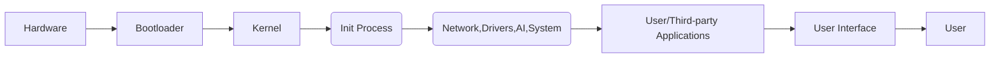

# Umer OS Master Design Prompt

## Executive Summary  
**Umer OS** is envisioned as a **Python-first hybrid classical+quantum, AI-native, cross-device operating system** to eventually replace existing desktop and mobile OSs (Linux, Windows, Android, macOS, etc.). It blends a modern **microkernel architecture** with built-in **quantum simulation** and **future QPU integration**, **local AI assistants**, and full backward compatibility. Key goals include **minimal storage/memory footprint**, **maximal efficiency** (through AI scheduling and quantum-inspired algorithms), and an **intuitive, adaptive UI/UX**. Umer OS will support a universal developer ecosystem (SDK, package manager, container system) and seamless cross-device/cloud sync. The system will be **modular**, **secure (zero-trust, quantum-safe)**, and **data-privacy-first**.  

## Project Goals & Scope  
- **Hybrid Kernel**: Build a new **“Umer Hybrid Quantum Kernel”** – a microkernel in Python (with minimal C/C++ for low-level primitives) managing processes, memory, devices, and IPC. Services (drivers, filesystem, network, UI, AI, etc.) run as user-space Python modules.  
- **Quantum Integration**: Include a **quantum simulation framework** and ready-to-integrate APIs for future QPUs. Provide **quantum-safe cryptography** and quantum-inspired optimization (e.g. superposition-inspired parallelism, entanglement for secure communication).  
- **AI-Native**: Embed an **AI assistant** (local LLM and ML engine) for resource optimization, code assistance, UI personalization, security monitoring, etc. Local training is permission-based and on-device (edge inference with ONNX/TensorRT, respecting privacy).  
- **Cross-Device & Backward Compatibility**: Run on PCs, laptops, servers, smartphones (ARM/Android), tablets, IoT. Provide containerized compatibility layers: e.g. **Wine-like subsystem for Windows binaries**, **Android APK runtime**, Linux binary support, etc. Use virtualization (QEMU/KVM/Docker) to isolate legacy apps.  
- **UX/HCI**: Design a modern UI supporting multi-touch, voice and gesture, VR/AR in future. Support multiple languages and accessibility. Emphasize “human-computer interaction” where systems are “intuitive, efficient, and enjoyable to use”.  
- **Security & Privacy**: Adopt zero-trust design. Secure bootloader with user opt-in (liability notice). Sandboxed apps with strict permission model. Quantum-safe encryption (post-quantum TLS). Minimal telemetry; user controls data, with transparent AI privacy model.  
- **Developer Ecosystem**: Provide a robust SDK and CLI (think `umer-sdk`, `umerctl`), integrated build/CD pipeline, emulators (Android, iOS, QEMU VM), and support popular languages (Python primary, plus Rust/C/C++, JS, etc.). Include AI-assisted IDE plugins.  
- **Deployment & Updates**: Over-the-air updates via Git-like branches. Use tested A/B partition scheme with rollback. Backup/recovery mode for safe uninstall.  
- **Timeline**: Phased approach (see table below): Research & prototyping in first 1–2 years, Alpha by ~Year 3, Beta with core functionality by ~Year 5, initial production/hardware deployment by Year 10, full maturity by Year 20 (with widespread QPU adoption and “superintelligence” features).  

| Phase           | Description                                               | Timeline (approx.)  |
|-----------------|-----------------------------------------------------------|---------------------|
| **Research**    | Architecture design, proof-of-concept microkernel, quantum simulation layer, AI assistant model selection.  | Year 1–2           |
| **Prototype**   | Develop Python microkernel scaffold, basic process/memory management, simple UI shell, QPU API stubs. Integrate Qiskit/Cirq/PennyLane for quantum simulation. Build initial AI assistant stub using an LLM. | Year 2–3 |
| **Alpha**       | Add device drivers, filesystem (e.g. a simple log-structured FS), network stack. Implement compatibility containers (basic Wine/Android runtime). More AI features (resource scheduler, UI suggestions). Early security modules. | Year 3–5 |
| **Beta**        | Refine performance, add hardware acceleration (GPU, ML accelerators), finalize developer SDK and package manager. Enhance UI/UX with voice/gesture support. Focus on stability and mobile/desktop installs (Android devices via custom ROMs; note: iOS requires jailbreaking). Community testing. | Year 5–7 |
| **Production**  | Official “1.0” release targeting specialist hardware and willing early adopters (Linux/Android communities). Establish certification (compatibility suites for Windows/Linux/Android apps). Ongoing AI model updates and gradual cloud service integration. | Year 7–10 |
| **Maturity**    | Broad ecosystem adoption. Begin integrating actual quantum co-processors as they become available. Work with device manufacturers to offer Umer OS on new devices. Continue AI enhancements (e.g. on-device model training). Global releases for smartphones, PCs, IoT by Year 15+. | Year 10–20 |

*(Table: Phased roadmap – each phase builds on previous, delivering incremental stability and features.)*  

## High-Level OS Architecture  

- **Bootloader**: Secure chain of trust; loads and verifies `kernel.img` and `initramfs`.  
- **Kernel (Umer Microkernel)**: Core in Python (with minimal C for hardware init), handling scheduling, IPC, memory protection, and loading user-space modules. Includes a **Quantum Simulator Layer** as part of kernel (for QPU calls) and an **AI Orchestration Engine**.  
- **User Space Services**: Most OS services run as Python processes: device **drivers**, **file systems**, **network stack**, **graphics/UI server**, **audio**, **AI Assistant**, etc. They communicate via message-passing IPC.  
- **Compatibility Layer**: Runs legacy apps in isolated containers/VMs: e.g., use **Wine (LGPL)** for Windows apps, an **Android Subsystem** (like Anbox), and support Linux binaries (native). Possibly leverage **QEMU/KVM** for full-VM when needed.  
- **Applications/Users**: Native Umer OS apps (Python/JS/C++ etc.), web apps, and existing mobile/desktop apps through compatibility.  
- **Cloud/Sync**: Optional cloud backend for user data sync, remote execution (e.g. heavy AI tasks), and updates (via digital signatures).

## Kernel Architecture  
- **Modular Microkernel**: Minimal core: memory manager, scheduler, IPC, basic driver interfaces. All else in user mode.  
- **Memory Management**: Virtual memory support, memory protection domains for processes. Abstract Python objects map to pages; GC and swap managed by hypervisor if needed (QEMU/KVM).  
- **Process Management**: Processes are isolated Python interpreters or containers. Use priority-based scheduling, with an **AI scheduler** component to adapt based on workload and predicted tasks.  
- **Device Management**: Generic driver API; hardware abstraction layer for CPU, GPU, NIC, storage. Many drivers as user-space modules. GPU/TPU handled by specialized drivers that register compute resources.  
- **Quantum Layer**: Kernel embeds a **Quantum API** (QAPI) that exposes qubits (simulated via Qiskit/Cirq/PennyLane) to user-space. A **Quantum Task Scheduler** dispatches quantum routines (mixing CPU/GPU/QPU). Manage qubit state, error correction simulation. (Cite: Qiskit “heterogeneous orchestration”).  
- **Security**: Enforce mandatory access controls between domains. Kernel implements **zero-trust checks**, encrypted inter-process channels, and a secure enclave (TEE) hook for cryptography.  
- **Driver Framework**: Python CFFI for low-level interfaces. Add-ons: common drivers (ACPI, USB, Wi-Fi, etc.) possibly from Linux source with bindings.

## Quantum Layer Architecture  
- **Quantum Simulator**: Use **Qiskit**, **Cirq**, or **PennyLane** libraries to emulate QPU circuits on CPU/GPU. Provide an abstraction of qubits/gates for apps.  
- **Qubit Abstraction**: Present qubits as special device files or APIs. Allow user to `open("/dev/umerQPU")` and submit quantum circuits.  
- **Hybrid Execution**: A **quantum-classical scheduler** decides what runs on CPU vs QPU. Use **superposition-inspired** parallelism (e.g., simulate many circuit branches) and **entanglement-inspired** secure comms.  
- **Error Mitigation**: Since fault-tolerant QPUs are future tech, implement software error mitigation (repeat circuits, majority vote, error-correcting codes algorithms). Acknowledge **quantum decoherence** as a constraint – full error-free computing is a future goal, not a given today.  
- **Plugins/Providers**: Support plugins for hardware backends: AWS Braket, IonQ, Rigetti, etc. (Qiskit and Cirq are backend-agnostic).  
- **Quantum-Safe Crypto**: Integrate NIST-approved post-quantum algorithms (e.g. Kyber, Dilithium) to secure the OS.

## AI System Architecture  
- **AI Assistant**: Local, permission-based LLM (e.g., distilled GPT-type) and other models for tasks. Runs in containerized environment with GPU/TPU acceleration. Provides features like context-aware help, code generation, command suggestions, and resource advice.  
- **On-Device Training**: Users can opt in to let their data (anonymized) refine models. Use on-device ML frameworks (ONNX Runtime, TensorFlow Lite, PyTorch with libtorch) and hardware acceleration (TensorRT for NVIDIA GPUs, Neon/Vulkan for others).  
- **Orchestration Engine**: Kernel-level agent schedules AI tasks, manages model caching, distributes inference across CPU/GPU/remote (if allowed). AI monitors system health (anomaly detection) and can auto-optimize settings.  
- **Privacy Model**: All AI data handling follows strict privacy: no training without explicit consent, local-only by default. Comply with best practices (GDPR, IEEE P700x).  
- **APIs/SDKs**: Provide Python APIs for developers: call the AI assistant or specialized vision/speech ML models. Include example vision/microphone preprocessing modules.

## Security Architecture  
- **Secure Boot**: Only signed Umer OS kernels/drivers. Show user a legal **“Install Disclaimer”** at first boot (e.g.: *“Installing Umer OS may void your warranty or risk device instability. You install at your own risk”*). Explicit opt-in required before proceeding.  
- **Cryptography**: All communications (network, IPC) encrypted. Use both classical (AES, RSA/ECC) and quantum-resistant (Kyber/Dilithium) algorithms.  
- **Sandboxing**: User apps run in isolated containers with least privilege. No root access to untrusted apps.  
- **AI Threat Detection**: The AI assistant scans processes to detect anomalies (e.g. unexpected memory writes).  
- **Firewall/Network Security**: Integrated host-based firewall. Secure by default (deny incoming, minimal ports).  
- **Multi-User Separation**: Users and system processes have separate domains. Files and settings are per-user/encrypted.  
- **Regular Updates**: Automatic security patches. A/B partitioning ensures rollback if update fails.  

## Filesystem Design  
- **File System**: A fast, robust FS (e.g. a modern journaled or log-structured FS like F2FS or btrfs-like). Possibly layered: local FS for system, encrypted user partitions.  
- **Virtual FS for Containers**: Overlay/union mounts for app sandboxes (similar to Docker overlayfs).  
- **Quantum Distributed FS (Future)**: Research into quantum-safe distributed file protocols (e.g. QFS) for cloud sync. For now, use encrypted cloud (Nextcloud/S3).  

## Driver Architecture  
- **Modular Drivers**: Drivers as user-space modules communicating with kernel via IPC. This follows microkernel principles.  
- **Hardware Support**: Start with open-source drivers from Linux (e.g. via repurposing libhal-equivalent). Use Python's ctypes/FFI to wrap low-level calls.  
- **GPU/TPU Drivers**: Interface with existing graphics stacks (Vulkan/DirectX?), or use Mesa/Vulkan through Python bindings (cffi). Possibly use wgpu or other cross-API layers.  
- **Mobile Hardware**: Provide HAL for camera, touchscreen, sensors via standardized APIs (like Android's HAL approach).  

## Compatibility Layer Design  
- **Windows (Wine)**: Integrate a Wine-like subsystem (Wine is LGPL) for Win32 API compatibility. Containers with `wineprefix` per app.  
- **Android**: Use an **Android Runtime Container**: either repackaging Anbox or building a minimal Android VM (e.g. with QEMU user-mode). Include Google Mobile Services replacement (e.g. MicroG).  
- **Linux**: Native support is built-in (since Umer OS is Linux-like). Possibly provide `ld-linux.so` and glibc compatibility.  
- **Games/Hardware**: Support GPU passthrough to VMs for gaming. Leverage Proton techniques for DirectX (translate to Vulkan).  
- **APKs and App Stores**: Tools to sideload from Google Play/iOS App Store equivalents. Emulate ARM if needed (QEMU user-mode for x86 Android apps).  

## UI/UX System Design  
- **Adaptive GUI**: Built on a modern toolkit (GTK/Vulkan or Web-based engine). Support themes, vector graphics, high-DPI.  
- **Input Modes**: Keyboard/mouse, touch, pen, voice (integrate speech-to-text engines), gestures (with depth camera sensors in future).  
- **Multilingual & Accessibility**: UI text localized; screen reader and high-contrast modes. Eye-tracking/gesture for accessibility.  
- **Cloud Sync UI**: Unified account system (like Google/Apple ID) for settings sync, with privacy consent screens.  
- **AI Assistance in UI**: Suggest shortcuts, auto-complete commands, predictive menus.  
- **Backup/Recovery UI**: Provide a **Recovery OS** (similar to GRUB) to restore previous OS or revert Umer install.  

## Networking Stack  
- **TCP/IP (6)**: Use a modern BSD-derived stack, supporting IPv4/IPv6, Wi-Fi, Ethernet, 5G cellular.  
- **Quantum Networking**: Research-only: placeholder for quantum key distribution or entangled communication (acknowledge in docs).  
- **Secure VPN**: Built-in WireGuard/OpenVPN support.  
- **Peer-to-Peer Sync**: Optionally include IPFS or Dat network support for decentralized syncing of user data.  

## Cloud Integration  
- **Cloud Services**: Connect to major clouds (AWS, Azure, GCP) as optional add-ons for compute or storage (e.g., offload AI training to cloud).  
- **File Sync**: Choose or build a client (like Nextcloud/Fly by Wire) for seamless file sync.  
- **Compute Offload**: API to delegate heavy tasks to HPC/quantum cloud if user allows.  
- **Privacy**: End-to-end encryption for all cloud data.  

## Mobile Device Strategy  
- **Android Phones/Tablets**: Targeter ROM: root devices, unlock bootloader, install Umer via a custom recovery (like TWRP). On devices with open bootloader (e.g. older Pixel, Samsung Exynos) this is feasible.  
- **iPhone/iPad**: Apple’s locked boot chain prevents third-party OS installation without jailbreak/exploit. Note as **assumption** that mainstream iOS devices are *not* targetable; focus on Android/Linux-based phones.  
- **Smartwatches/IoT**: Build a minimal Umer variant (UmerOS-Light) using MicroPython for low-resource devices.  
- **Cross-Device Continuity**: Feature akin to Apple’s Continuity: Auto-switch/cast displays, clipboard sharing, messaging integration.  

## iPhone/Android Installation Constraints  
- **Android**: Requires unlocking bootloader (some vendors lock it). Provide scripts to install via fastboot/odin/Download Mode.  
- **iOS**: Unless jailbroken or using **Apple Silicon Macs** (which can virtualize Linux easily), direct install is blocked. Document this as a *limitation*.  
- **Legal Disclaimer**: Installing Umer OS likely voids manufacturer warranty. Display a **Warning dialog**: *“Warning: Installing Umer OS replaces the original system. You accept all risks (bricking device, data loss). Umer OS provides no liability.”* User must explicitly confirm (e.g. type YES).  

## Performance Optimization Plan  
- **Storage Footprint**: Compress the OS (similar to Alpine Linux); use deduplication (Btrfs/ZFS). Offload logs to cloud or truncate by policy.  
- **Memory & CPU**: AI scheduler and memory manager optimize caching. Use just-in-time loading of modules. Benchmark and tune Python (PyPy or C-extensions for hotspots).  
- **GPU/ML Acceleration**: Offload ML tasks (AI assistant) to GPU (ONNX Runtime with CUDA/TensorRT, or ROCm for AMD). Graphics use GPU via Vulkan for UI.  
- **Distributed Compute**: For heavy tasks, optionally split across devices (e.g. smartphone & paired laptop) or cloud.  
- **Quantum Speedups**: Where possible, use quantum algorithms (e.g. Grover’s for search) in back-end tasks (future).  

*(Note: Performance gains rely on **algorithmic efficiency and hardware acceleration**, not any “magic” speed. Real gains will come from optimizing code paths and using specialized processors.)*  

## Developer Ecosystem  
- **SDK & Build Tools**: Provide a CLI (`umer-cli`) to initialize projects, cross-compile, and test. Support Rust/C/C++ via cross-compiler toolchains (GCC/Clang for Linux, Android NDK, Apple’s clang for mac/ARM).  
- **Package Manager**: A central repo (like PyPI/NPM) for Umer packages, plus compatibility with apt/rpm. Use Docker/Podman for reproducible builds.  
- **Container System**: Support Docker and Kubernetes natively (or Umer-native “boxes”). Provide examples to containerize Linux/Windows apps on Umer.  
- **Emulators/Simulators**: Include Android emulator (Android Studio’s AVD or QEMU-based), and VirtualBox/KVM images for testing Umer in PCs.  
- **ML/AI Dev**: Bundled support for TensorFlow, PyTorch, ONNX. Example notebooks and model zoo.  
- **IDE Plugins**: Example integration with VSCode and PyCharm for Umer (e.g., `umer-cli` plugin for running commands).  
- **API Documentation**: Auto-generate from code (Sphinx for Python, Doxygen for C parts) and publish as docs (docs.umeros.org).  

## Boot Process (Mermaid Diagram)  
```mermaid
flowchart LR
    PowerOn --> ROMBIOS[ROM/BootROM]
    ROMBIOS --> Bootloader[Umer Bootloader (verified)]
    Bootloader --> LoadKernel[Load & Verify kernel.img]
    LoadKernel --> KernelInit[Kernel Entry]
    KernelInit --> Initramfs[Load initramfs]
    Initramfs --> Systemd[Start init process]
    Systemd --> Services[Start background services]
    Services --> LoginManager[GUI/CLI login]
    LoginManager --> UserSession[User Desktop/Apps]
```
This flow ensures **trusted boot** (load code only if signed) and provides a **recovery path** (bootloader can choose Umer or fall back to original OS).  

## Package Management System  
- Hybrid: Use **pip/conda** for Python, and a new `umerpkg` for system packages (written in Python, similar to `apt`).  
- Support container images (Docker format) and flatpak/snaps for distribution.  
- Include automatic **semantic versioning** and `requirements.txt` for dependency tracking.  

## Backup & Recovery System  
- **Snapshotting**: On setup, use filesystem snapshots (e.g. Btrfs) or LVM for system and home.  
- **Recovery Mode**: On boot, hold a key to enter recovery: restore last known-good snapshot, or reinstall.  
- **Uninstall**: Provide a script to revert bootloader changes and restore original OS if desired.  
- **Cloud Backup**: Optionally back up user data (encrypted) to cloud before uninstall.  

## AI Governance & Privacy Model  
- **Data Minimization**: Log only necessary telemetry. No raw user data offloaded.  
- **Explainability**: Any AI-driven change (e.g., suggested system setting) should come with an explanation.  
- **Fairness & Ethics**: Follow frameworks like FTC’s AI Principles and IEEE P7010.  
- **Opt-In Transparency**: Clearly list when data is sent to local AI training.  
- **Auditability**: Maintain logs of AI assistant actions (locally only).  
- **User Control**: Offer toggles to disable AI features or clear learned preferences.  

## Risks and Constraints  
- **Quantum Hype vs Reality**: Quantum computing is emerging. Current efforts use **simulation** (classical). We avoid claims of “zero-error” quantum today.  
- **Hardware Access**: Most devices (especially iPhones) do not allow custom OS installs. Umer’s reach will begin in niche communities (Linux/Android enthusiasts) and gradually expand.  
- **Performance Limits**: Python-based kernel is slow by nature; heavy lifting will need C/C++ or JIT compiling (PyPy) in hotspots. This is a research prototype vs production kernel.  
- **Security Complexity**: Combining AI, quantum, and OS complexity could introduce new vulnerabilities. We must prioritize formal verification (e.g. seL4-style proofs) for critical parts.  
- **Legal/IP**: Must avoid infringing vendor drivers or patented tech. Emphasize open-source toolchains and libraries (GPL/LGPL/Apache).  
- **Adoption Challenge**: Requires strong value to attract developers/users (thus focus on unique AI/quantum features and ease-of-use).  

## 5/10/20-Year Roadmap  
- **5-Year**: Umer OS Alpha/Beta with core features (Python kernel, basic AI assistant, compatibility for Linux/Android). Early hardware partners (Nvidia Jetson, Raspberry Pi) supported. Community of developers.  
- **10-Year**: Umer OS stable releases on PCs and select phones. Partnerships with CPU/GPU vendors. Introduction of early quantum coprocessor support (via cloud or local hardware). Widespread SDK adoption.  
- **20-Year**: Ubiquitous Umer OS (or derivatives) on devices. Fully integrated quantum hardware (local QPU or networked quantum cloud). AI assistant becomes an AGI-level system optimizing across devices. Operating system considered legacy replaced.

## Full Folder/Repo Structure (Example)  
```
UmerOS/
├── docs/                      # Architecture and user documentation
├── tools/                     # Build scripts, utilities
├── third_party/               # Cloned repos (Qiskit, Cirq, Docker files, etc.)
├── src/
│   ├── kernel/                # Microkernel core (Python + minimal C)
│   ├── drivers/               # Python driver modules (network, GPU, etc.)
│   ├── fs/                    # Filesystem modules
│   ├── network/               # Networking stack modules
│   ├── ai_assistant/          # AI assistant service (LLM, wrappers)
│   ├── quantum/               # Quantum API and simulator code
│   ├── ui/                    # GUI framework (Python/JS/C++)
│   ├── compatibility/         # Wine/Android subsystem code
│   └── init/                  # init process, systemd services in Python
├── examples/                  # Example apps, configs, workflows
├── tests/                     # Unit and integration tests
└── .ag/                       # Antigravity/agent configuration files (skills, metadata)
```

## Example Antigravity IDE Commands  
```bash
ag new-project UmerOS                # Initialize project scaffold
ag run build-kernel                  # Build the microkernel (compile C, package Python)
ag run build-quantum-simulator       # Package Qiskit/Cirq modules
ag run deploy emu.desktop            # Deploy to QEMU desktop VM for testing
ag run tests all                     # Run test suite
ag run package --format=docker       # Build Docker container image
```
*(These commands illustrate a potential CLI; actual Antigravity tool syntax may vary.)*  

## Installer & Rollback Plan  
- **Installer**: An interactive CLI/install wizard. Detect host OS, ask for target (root or user). It warns user and takes backup of current bootloader.  
- **Disk Partitioning**: Shrink existing partitions to create space or require a spare disk/USB. Format Umer partitions.  
- **Bootloader Update**: Install UEFI GRUB or shim that allows selecting Umer or original OS on boot (with signature check).  
- **Rollback**: If install fails or user chooses to uninstall, the installer script can restore original bootloader and partitions (if snapshots were taken). The OS includes a “factory reset” in recovery mode to revert to bootloader state.  

## Legal/Opt-In Warning Text (Example)  
```
WARNING: Umer OS is a custom operating system. Installing it may:
- Void your warranty.
- Void any existing software licenses.
- Cause compatibility issues with apps and hardware.
- Result in data loss if not backed up.
By typing "I AGREE" you acknowledge you have read this notice, back up your data, and accept all risks. Umer Systems, Inc. assumes no liability for any damages.
```

## Skills & Dependencies  
| **Skill/Area**            | **Team Role**            | **Notes/Tools**                                  |
|---------------------------|-------------------------|--------------------------------------------------|
| **OS & Kernel**           | Systems Engineers       | Linux kernel Dev, microkernels (QNX, MINIX)      |
| **Python & C/C++**        | Python/OS Engineers     | PyPy, CFFI, CPython, Clang/GCC                   |
| **Quantum Computing**     | Quantum Researchers     | Qiskit, Cirq, PennyLane, Qubit hardware concepts |
| **AI/ML / LLMs**          | ML Engineers / AI Devs  | LLM frameworks (OpenAI GPT, Llama, local LLMs), ONNX Runtime, TensorRT |
| **Security/Crypto**       | Security Engineers      | Encryption (AES, RSA, PQC), secure boot, sandboxing |
| **UX/HCI Design**         | UX/UI Designers         | Human-Computer Interaction principles, AR/VR for future |
| **Distributed Systems**   | Backend Developers      | Cloud APIs, P2P sync (IPFS), network protocols   |
| **Mobile Development**    | Mobile Engineers        | Android NDK/SDK, AOSP, iOS tooling (Xcode)       |
| **DevOps/CI-CD**         | DevOps Engineers        | Docker, Kubernetes, QEMU, KVM, Git/GitHub Actions |
| **Hardware/Drivers**      | Embedded Engineers      | Kernel modules, Linux driver model, device trees (DTB) |
| **Cryptography**          | Crypto Experts          | OpenSSL, libsodium, quantum-safe libs            |
| **Virtualization**        | Virtualization Engs     | QEMU, KVM, Xen, VirtualBox                       |
| **Cloud/Backend**         | Cloud Architects        | AWS/GCP/Azure SDKs, serverless (Slurm, HPC)      |
| **Legal/Compliance**      | Legal Counsel           | Software licenses (Apache2.0, GPL, LGPL), privacy laws |

**Dependencies:**  

- **Kernel-level:** Python 3.11+ (Mozilla Public License), **PyPy** (MIT License) for JIT speed-up, **C/C++ Compiler** (GCC/Clang, GPL/MIT), **Coreutils** (GPL), `systemd` (LGPL) or a lightweight init.  
- **Quantum SDKs:** [Qiskit](https://qiskit.org) (Apache 2.0, install `pip install qiskit`), [Cirq](https://quantumai.google/cirq) (Apache 2.0), [PennyLane](https://pennylane.ai) (Apache 2.0). These provide qubit abstractions, simulators, and hardware backends.  
- **AI/ML:** [ONNX Runtime](https://onnxruntime.ai) (MIT, for model inference acceleration), [TensorRT](https://developer.nvidia.com/tensorrt) (proprietary/NVIDIA GPU acceleration), [PyTorch](https://pytorch.org, BSD) or [TensorFlow Lite](https://www.tensorflow.org/lite, Apache 2.0) for local model training/inference. [CUDA](https://developer.nvidia.com/cuda) (NVidia, proprietary free) / [ROCm](https://rocmdocs.amd.com, Apache 2.0) for GPU. [Hugging Face Transformers](https://github.com/huggingface/transformers, Apache 2.0) for LLM interfaces.  
- **Virtualization & Containers:** [QEMU](https://www.qemu.org, GPL), [KVM](https://www.linux-kvm.org, GPL), [Docker](https://docker.com, Apache 2.0) & [containerd](https://containerd.io, Apache 2.0) for container orchestration. [Kubernetes](https://kubernetes.io, Apache 2.0) for orchestration. [Wine](https://winehq.org, LGPL) for Windows compatibility. [Android SDK/NDK](https://developer.android.com, Apache 2.0) for Android apps.  
- **Cross-Compilation:** [GCC/Clang](https://gcc.gnu.org, GPL/MIT), [CMake](https://cmake.org, BSD) or [Meson](https://mesonbuild.com, Apache 2.0). [Rust toolchain](https://www.rust-lang.org/tools/install, MIT/Apache2) for Rust support.  
- **Mobile Tooling:** Android Studio (Gradle), iOS Xcode Command Line Tools (free Apple license). [Flutter or React Native SDK](https://flutter.dev, BSD; https://reactnative.dev, MIT) for cross-platform apps.  
- **Cryptography:** [OpenSSL](https://openssl.org, Apache 2.0), [libsodium](https://libsodium.org, ISC) for crypto primitives, [libpqcrypto](https://pqcrypto.org, MIT) or [NIST PQC libs](https://csrc.nist.gov/projects/post-quantum-cryptography) for post-quantum ciphers.  
- **Libraries:** [GLFW](https://www.glfw.org, zlib) or [Qt](https://www.qt.io, LGPL/GPL) for graphics; [GTK4](https://www.gtk.org, LGPL) or [Electron](https://electronjs.org, MIT) for UI. [SQL](https://sqlite.org, Public Domain) or [PostgreSQL](https://www.postgresql.org, PostgreSQL License) for storage.  
- **Build/CI:** [Git](https://git-scm.com, GPL), [GitHub Actions](https://github.com/features/actions, MIT) or [GitLab CI](https://docs.gitlab.com/ee/ci/, MIT), [make](https://www.gnu.org/software/make/, GPL) or [Bazel](https://bazel.build, Apache 2.0).  
- **Driver Toolkits:** [Linux Kernel headers](https://www.kernel.org, GPL) for reference; [Device Tree](https://elinux.org/Device_Tree, various licenses) tools; [Mesa3D](https://docs.mesa3d.org, MIT/X) for graphics drivers; [libdrm](https://dri.freedesktop.org/wiki/), [libusb](https://github.com/libusb/libusb, LGPL) for USB, [Bluetooth BlueZ](http://www.bluez.org, GPL) stacks.  

*Each dependency should be installed via its official URL or package manager. Licenses noted above (Apache-2.0, MIT, GPL/LGPL, etc.) indicate compatibility. Prefer latest stable versions (e.g. Qiskit v2.x, Cirq latest, Python 3.11+, CUDA 12.x, Android API level 36, etc.).*  

## Tables  

| **Phase**   | **Key Deliverables**                                 | **Timeline**          |
|-------------|------------------------------------------------------|-----------------------|
| Research    | Architecture docs, tech spikes (quantum, AI), prototypes of kernel and quantum layer. | Months 1–18  |
| Prototype   | Python microkernel scaffold, basic services, quantum simulation demo, AI assistant stub.  | Months 18–36 |
| Alpha       | Device drivers, filesystem, compatibility for Linux apps, initial UX shell, package manager.  | Year 3–5   |
| Beta        | GPU/ML acceleration, Android compatibility, security enhancements, developer SDK alpha. | Year 5–7   |
| Production  | Stable release, developer adoption, initial hardware vendor support.         | Year 7–10  |

*(Table: Phased roadmap overview.)*  

| **Component**       | **Dependencies / Tools**                            |
|---------------------|-----------------------------------------------------|
| Microkernel Core    | Python 3.11+, PyPy, C/C++ compiler, Linux headers    |
| Device Drivers      | Linux driver code (C), Python CFFI, device-tree tools |
| File System         | Existing FS libs (ext4/btrfs code), Python bindings |
| Networking          | BSD sockets (C library), lwIP (MIT) or Linux net stack |
| UI Framework        | GLFW/SDL (MIT), Vulkan (Khronos), Qt/GTK            |
| AI Assistant        | Transformers, ONNX Runtime, TensorRT, NumPy/Scipy   |
| Quantum Layer       | Qiskit (Apache2), Cirq (Apache2), PennyLane (Apache2) |
| Compatibility       | Wine (LGPL), Android Emulator (QEMU)    |
| Containerization    | Docker Engine (Apache2), containerd, Kubernetes     |
| Cryptography        | OpenSSL (Apache2), libsodium (ISC)                  |
| Build System        | Make/CMake/Bazel (GPL/Apache2), Git/GitHub Actions   |

*(Table: Key components mapped to major dependencies/tools.)*  

| **Skill**           | **Team Role**                | **Example Tasks**                                   |
|---------------------|-----------------------------|-----------------------------------------------------|
| OS & Microkernel    | Kernel Engineer             | Kernel design, IPC, memory mgmt.                    |
| System Security     | Security Engineer           | Encryption, sandboxing, secure boot.                |
| Quantum Computing   | Quantum Researcher          | QPU APIs, circuit sim, error-correction research.   |
| AI/ML Engineering   | ML Engineer/AI Scientist    | LLM fine-tuning, model optimization (ONNX, TensorRT). |
| UI/UX Design        | UX Designer                | HCI research, prototype UI, AR/VR interfaces.       |
| Graphics/GPU Dev    | GPU Engineer                | Vulkan/GL driver development, compute shaders.      |
| Embedded/Mobile     | Embedded Engineer           | Android kernel port, drivers for hardware modules.  |
| Cloud/Infra         | Cloud Architect             | CI/CD pipeline, cloud scaling, distributed sync.    |
| DevOps              | DevOps Engineer             | Docker/K8s integration, CI pipelines, QA automation.|

*(Table: Required skills vs. team roles and tasks.)*  

## Appendix: Initial Code Prototypes

### Kernel Scaffold (Python/Pseudocode)  
```python
# src/kernel/main.py
import umer_ipc, umer_mem, umer_sched

def kernel_init():
    # Basic hardware initialization (in C, e.g., setup interrupt table)
    umer_ipc.init()        # Initialize IPC system
    umer_mem.init()        # Set up memory management
    umer_sched.init()      # Start scheduler
    # Start init process
    umer_ipc.spawn("src/init/init.py")

if __name__ == "__main__":
    kernel_init()
```
*(Comments explain that low-level boot in assembly/C jumps into this Python entry point.)*

### Quantum Simulation Module (Python)  
```python
# src/quantum/simulator.py
from qiskit import Aer, QuantumCircuit, execute
from cirq import Simulator as CirqSim

class QuantumSimulator:
    def __init__(self):
        self.sim = Aer.get_backend('qasm_simulator')

    def run_qiskit(self, circuit: QuantumCircuit, shots=1024):
        job = execute(circuit, backend=self.sim, shots=shots)
        return job.result().get_counts()

    def run_cirq(self, cirq_circuit, repetitions=100):
        sim = CirqSim()
        result = sim.run(cirq_circuit, repetitions=repetitions)
        return result
```
*(Uses Qiskit’s Aer simulator and Cirq’s simulator for demo.)*

### AI Assistant Stub (Python)  
```python
# src/ai_assistant/assistant.py
from transformers import pipeline

class AIAssistant:
    def __init__(self):
        # Load a lightweight local LLM model
        self.nlp = pipeline("text-generation", model="distilgpt2")
    def answer(self, prompt):
        response = self.nlp(prompt, max_length=100)
        return response[0]['generated_text']

assistant = AIAssistant()
print(assistant.answer("System update available. What next?"))
```

### Compatibility Container Launcher (Pseudo)  
```bash
# tools/run_win_app.sh
APP_PATH=$1
WINEPREFIX=~/.umer/wineprefix
mkdir -p $WINEPREFIX
# Launch a Windows exe inside Wine container
wine $APP_PATH
```

### GUI Prototype (Simple)  
```python
# src/ui/simple_ui.py
import tkinter as tk

def main():
    root = tk.Tk()
    root.title("Umer OS Shell")
    label = tk.Label(root, text="Welcome to Umer OS!", font=("Arial", 24))
    label.pack(padx=20, pady=20)
    root.mainloop()

if __name__ == "__main__":
    main()
```
*(This Tkinter stub demonstrates a window; eventual UI would be far richer.)*

### Build Instructions (Example)  
```bash
# Build the kernel (pseudocode)
gcc -o build/boot.o -c src/kernel/boot.S
python3 -m zipapp src/kernel -o build/kernel.pyz
# Build ISO or disk image with UEFI loader
mkisofs -o umeros.iso -b isolinux.bin -c boot.cat -no-emul-boot .
```
*(These commands illustrate possible steps; actual build may use custom scripts or Makefile.)*

## Next Steps for Iterative LLM Use  
1. **Generate Subsystem Details:** Prompt the LLM to expand one subsystem at a time (e.g., “Describe the memory management module in detail with example code”).  
2. **Design Documents:** Ask for full design docs or sequences (e.g., “Write a CFFI wrapper for a PCI driver for Linux in Python”).  
3. **Architecture Diagrams:** Use the mermaid templates above and refine (`ag run`) to visualize specific flows.  
4. **Mock Interactions:** Simulate installer flow or user commands by LLM to validate CLI/UX.  
5. **Testing Plans:** Request test cases (e.g., “How to test the quantum simulator accuracy?”).  

This completes the **Umer OS master prompt** and skills/dependencies specification. It is intended as a comprehensive blueprint and working prompt for Antigravity IDE to iteratively generate code and documentation for the project.

