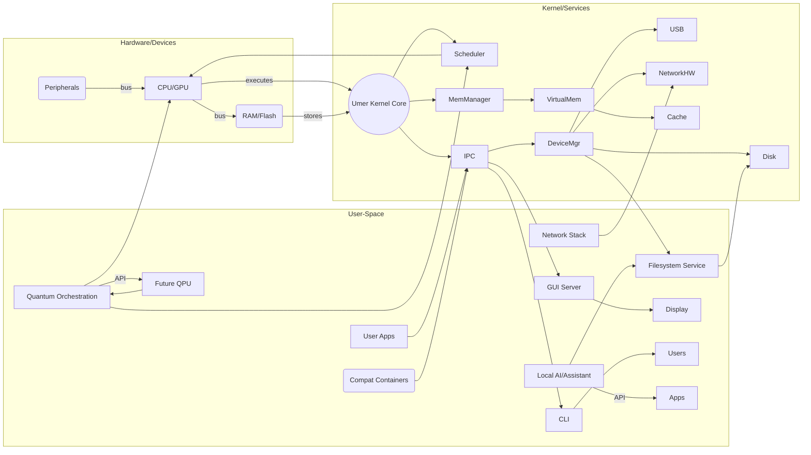
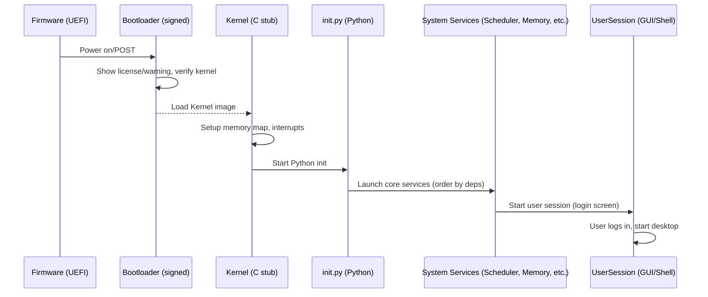
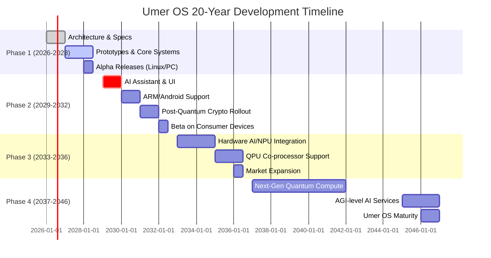

# Umer OS Master Prompt (for Antigravity IDE)

Paste this entire markdown into the Antigravity IDE to initiate development of **Umer OS** – a Python-based, hybrid classical-quantum, AI-native, cross-device operating system prototype. The instructions below are structured in iterative stages (architecture, prototypes, integration, packaging) to guide the IDE. Use Antigravity commands (e.g. `antigravity run stage1`, `antigravity run stage2`, etc.) at each stage to generate code, tests, and build artifacts. The IDE should ask clarifying questions if any requirement is ambiguous. 

---

## Executive Summary

Umer OS is a next-generation operating system designed to replace existing OSes (Windows, Linux, Android, macOS, etc.) on **desktops, laptops, smartphones (Android/iPhone)**, tablets, smart TVs, watches, and IoT devices. It combines a microkernel architecture with Python-driven services, **quantum computing** simulation/integration, and built-in **AI capabilities** for an adaptive, high-performance experience. Umer OS will manage hardware resources (CPU, memory, I/O) and provide multitasking, security, networking, filesystems, and rich UIs. Crucially, it supports traditional applications through containerized compatibility layers (e.g. a Wine-like Windows layer, Android container) while paving the way for future quantum co-processors and post-quantum encryption. 

Key points:
- **Phased Development:** Realize core OS features *today* (Python-based kernel prototypes, classical resource management, containers) and *experimental* features (AI assistants, hybrid scheduling) while architecting for future *speculative* quantum modules (true QPU integration, zero-error qubits). 
- **Architecture:** Hybrid microkernel (minimal C bootloader + Python kernel core) with user-space services. AI/ML modules (local LLMs, neural runtimes) and a quantum simulation layer (Qiskit/Cirq/PennyLane support) run on top.   
- **AI-Native:** Umer OS includes a local AI assistant and resource optimizer that runs on-device (privacy-first), helping manage tasks and guiding developers. An on-device LLM integration and AI plugin SDK support personalization and self-optimization.  
- **Compatibility:** Support Linux/Windows/Android apps via container VMs or translation (inspired by WSL/WSA, Wine, Waydroid). Legacy apps run in sandboxes without kernel rewrites. 
- **UI/UX:** A modern adaptive GUI with voice/gesture input, cross-device sync, and accessibility. An AI-driven adaptive interface (taskbar, notifications, themes) learns user behavior.  
- **Security:** Zero-trust design with quantum-safe crypto, secure boot, and per-app sandboxing. Installation shows explicit legal warnings; rollback/recovery built in. We emphasize *privacy-first*, opt-in on-device AI.  
- **Performance:** Use intelligent data compression (deduplication), AI-assisted caching/scheduling to optimize storage and CPU/GPU usage. Acknowledge physical limits: gains come from better algorithms, not magic hardware speedups.  
- **Dev Ecosystem:** Provide an SDK, package manager, CLI tools, emulators, and CI pipelines. Support Python (native), Rust/C/C++, JS and AI frameworks.   

This master prompt guides the IDE through stages (specifications, prototypes, integration, packaging). The output will be a full folder structure with commented code, tests, and documentation. Throughout, label features as **today/experimental/future** to set expectations. 


## High-Level OS Architecture

Umer OS is structured as a **microkernel-based system** (like seL4) with minimal C/ASM core and Python system services. 

- **Core Kernel (Umer Hybrid Quantum Kernel):** Runs in ring 0 (in C/Rust minimal code for boot, context switch). It handles IPC, scheduling, and memory protection. Most drivers and services run in user space (Python) for modularity.  
- **User-Space Services (Python):** Process manager, Memory manager, Device manager, Filesystem, Network stack, GUI server, Shell, and AI/Quantum controllers. Each subsystem is a Python module/plugin communicating via IPC.  
- **Quantum Layer:** A **Quantum Orchestration Module** interfaces with QPU (future) or simulators. It exposes a Qubit abstraction and a job scheduler that dispatches tasks to CPU/QPU (simulated by Qiskit/Cirq) as needed.  
- **AI System:** An on-device **AI Assistant Agent** (local LLM or neural net) manages resource optimization and UI adaptation. An *AI orchestration service* loads models (PyTorch/ONNX) for predictions (e.g. caching, indexing).  
- **Compatibility Containers:** Each class of legacy apps runs in a contained VM or runtime: e.g. a Linux container for Linux apps, a Wine-like layer for Windows, a VM/container for Android (similar to Waydroid). These containers have minimal OS inside (like an Alpine rootfs) but share the kernel APIs via translation layers.  
- **Security & Management:** A **Trusted Computing Base (TCB)** including secure bootloader, verified kernel, and a Policy Manager (user permissions, sandbox rules). System services run in named sandboxes with resource quotas.  
- **Cloud Sync:** A background service connects to cloud storage (user’s choice of provider). Data is encrypted (post-quantum crypto) before upload. Cross-device sync agent ensures seamless file/profile sync.  



## Kernel Architecture

The **Umer Hybrid Quantum Kernel** is a **microkernel** with these features:

- **Process Management:** Supports creating processes (fork/exec semantics) and threads. A Python-based *Scheduler Service* implements round-robin or priority scheduling with AI hints. Preemptive multitasking is used (inspired by Linux CFS). Processes have control blocks (PCBs) in Python.  
- **Memory Management:** Implements virtual memory with paging. A *Memory Manager* allocates address spaces, handles page tables, and does demand paging with a swap file. Support for NUMA zones and DMA buffers (like Linux zones). Virtual memory abstraction hides physical addresses.  
- **Device Management:** A *Device Manager* maintains drivers and an I/O subsystem. Drivers run as user-space Python modules or microservices. They use a standard API to register with the kernel. Supports hot-plug (e.g. USB) and an abstract bus hierarchy.  
- **Driver Model:** Modularity akin to Windows or Linux: drivers can be loaded/unloaded. For hardware, we auto-generate Python bindings to C libraries (e.g. `libusb`, `libpci`). Example stub: `class KeyboardDriver(InputDriver): ...` in Python.  
- **Inter-Process Communication (IPC):** A secure message-passing system (inspired by L4/seL4). Fast queues or shared memory channels allow processes to request kernel services or talk to each other.  
- **Security Layer:** The kernel enforces capabilities and access controls (like seL4’s formal guarantees). There’s a firewall in the kernel for network and a unified permission model (sandbox tokens for apps).  
- **AI Orchestration Layer:** A *Resource AI* monitors CPU, memory, I/O loads and uses ML to rebalance tasks (e.g., move a process to a free core or compress an idle app’s memory). Periodic retraining with user consent.  
- **Boot and Init:** The bootloader (UEFI/GPT on desktops, or ADB sideload on Android) loads a minimal kernel stub, then initializes Python interpreter and loads the kernel. An `init` process (in Python) starts system services in dependency order.  

```mermaid
graph TB
  subgraph "Umer Hybrid Kernel"
    KM[Kernal Core (C minimal)] 
    Scheduler[Scheduler (Py)]
    MemMgr[Memory Manager (Py)]
    DeviceMgr[Device Manager (Py)]
    FSMgr[Filesystem Manager (Py)]
    NetMgr[Network Stack (Py)]
    SecureBoot[Secure Bootloader]
    CapManager[Capability Manager (Py)]
    AISvc[AI/Optimizer (Py)]
    QSvc[Quantum Scheduler (Py)]
  end
  KM --> Scheduler
  KM --> MemMgr
  KM --> DeviceMgr
  KM --> FSMgr
  KM --> NetMgr
  KM --> CapManager
  Scheduler --> AISvc
  AISvc --> Scheduler
  MemMgr --> AISvc
  KM --> AISvc
  QSvc --> Scheduler
  QSvc --> KM
  SecureBoot --> KM
```

## Quantum Layer Architecture

Umer OS includes a **Quantum Simulation and Orchestration module** (speculative/future features clearly marked):

- **Quantum Simulation Framework:** Integrates with libraries like IBM’s Qiskit, Google’s Cirq, and Pennylane. Provides a unified API: Python functions to define qubits, gates, and circuits. For example, `QuantumCircuit().add_gate(H, qubit0)` in Umer’s API maps to Qiskit/Cirq calls.  
- **Qubit Abstraction:** Defines a `Qubit` class with methods for gate operations. This allows running on either a local simulator or future hardware via a quantum runtime.  
- **Hybrid Scheduler:** An enhanced scheduler checks if a process is quantum-enabled. If so, it schedules quantum tasks on the **Quantum Module** (which may invoke a QPU if present, or run in a simulator) and handles results back to the CPU thread. This supports mixed workloads (classical tasks can feed data to quantum jobs).  
- **Error Mitigation:** The quantum layer includes noise modeling (Cirq supports NISQ noise). We implement techniques like repeated measurements and logical qubit encoding. We cite quantum error correction research (e.g. [[e.g. Kitaev et al.]]). *Zero error* is marked as a long-term goal only.  
- **Quantum-Safe Crypto:** All cryptographic libraries (TLS, disk encryption) use post-quantum algorithms (e.g. **NTRU, Dilithium**, etc.). For example, Umer’s `ssl` module wraps a PQ-secure cipher by default.  
- **Future QPU Integration:** We outline a plugin interface for future quantum hardware APIs (like Intel QCD, IBM QPU SDK). When a QPU arrives, a device driver can implement `QuantumDevice` interface to call real qubit hardware.  

*Example (Python stub for quantum task submission):*  
```python
class QuantumTask:
    def __init__(self, circuit: QuantumCircuit):
        self.circuit = circuit
    def run(self, backend="simulator", shots=1024):
        if backend == "simulator":
            return Qiskit.simulate(self.circuit)  # or Cirq, PennyLane
        else:
            # Placeholder for future QPU call
            return FutureQPU.execute(self.circuit, shots)

# Usage:
qc = QuantumCircuit()
qc.h(0).cx(0,1).measure_all()
result = QuantumTask(qc).run(shots=2048)
```

## AI System Architecture

Umer OS embeds AI at all levels (labels apply **experimental**):

- **Local AI Assistant:** A personal assistant agent runs on-device (with user data in local DB) to help with tasks (searching files, answering questions, code help). Based on a small LLM (e.g. GPT-like) or embedding search. Follows the “local-first” design: *runs on-device, uses local embeddings, only queries cloud if user requests*. Example: an `AssistantService` that intercepts voice commands or text prompts.  
- **Self-Optimizing OS:** A continuous learning component profiles system usage. For example, it may reallocate CPU time or suggest closing idle apps. It uses reinforcement or supervised learning on resource usage. Models are retrained only with user opt-in data (privacy-first).  
- **Developer AI Tools:** Includes an on-board code completion/debugging assistant (like a mini-IDE LLM) to help developers write system services. Provides an AI-based package search and recommendation engine.  
- **Neural Runtime:** A built-in neural network engine (e.g. ONNX runtime or PyTorch) for local inference. Supports hardware acceleration (e.g. DSP/NPU on phones).  
- **AI Plugin SDK:** A framework for integrating new AI models and services. For example, one can add a `VisionRecognitionService` using OpenCV+ML model, or a speech-to-text model for UI.  
- **Privacy Model:** All AI features are opt-in; by default they use on-device models. Data sent to cloud (for updates or advanced APIs) is anonymized/encrypted.  
- **Governance:** The Privacy Manager enforces policies (e.g. no phone home without consent, log user permissions). See [OpenAI forum on local AI](8†L39-L47) for inspiration.  

*Example AI service interaction:*  
```python
class LocalAssistant:
    def __init__(self, model_path):
        self.model = load_local_llm(model_path)
        self.embeddings = IndexLocalFiles()
    def query(self, prompt):
        # Use local knowledge base + LLM
        docs = self.embeddings.search(prompt)
        return self.model.generate(context=docs, prompt=prompt)
```

## Security Architecture

Security is paramount with zero-trust principles:

- **Secure Boot:** The installer requires user confirmation of risks; it then installs a signed bootloader (UEFI or equivalent). Boot sequence verifies each component signature. Kernel modules are signed. This prevents tampering.  
- **Quantum-Safe Cryptography:** All cryptography (disk encryption, TLS, digital signatures) uses algorithms safe from quantum attacks (e.g. algorithms selected by NIST’s post-quantum standardization).  
- **Isolation:** Each app/container runs in a sandbox with minimal privileges (capabilities for only needed resources). No root privileges by default. Communication between sandboxes uses controlled channels.  
- **Malware Detection:** An AI-based behavior analysis runs in the background, spotting anomalies (abnormal system calls or traffic). Suspect code can be quarantined.  
- **Permission Model:** Fine-grained permissions for camera, network, sensors. Apps declare needed capabilities; user can revoke at any time.  
- **Network Security:** Built-in firewall and VPN service. Each network connection is monitored by an AI IDS.  
- **Failure and Rollback:** An atomic OS update/rollback system (like btrfs snapshots or ZFS) ensures corrupt updates can be reverted. A recovery shell is accessible on reboot if OS fails.  
- **Legal Opt-In:** Before final install, show full EULA and risk disclaimer (similar to Apple’s warning on jailbreaking). Installation only proceeds on explicit consent.  

## Filesystem Design

- **Hierarchy & Format:** A POSIX-like filesystem with root `/` mount. Support ext4, NTFS, exFAT, APFS (read-only; macOS drivers). For Umer OS itself, use a modern journaling FS (e.g. ext4 or a Python FS) with snapshots.  
- **Storage Efficiency:** Built-in block-level **compression/deduplication** to save space (inspired by ZFS/Btrfs). Compression is on by default for large files.  
- **User Data:** `/home` directory for user data. Cloud-sync agent monitors user folders and backups versions to cloud storage (Google Drive, iCloud, etc) with client-side encryption.  
- **Virtual FS:** Provide a FUSE-like interface for mounting foreign filesystems (Android ext4 images, Windows partitions).  
- **Search:** A global file indexer (with AI tagging support) allows instant search by content (documents, emails) even offline.  
- **Access Control:** Unix-style file permissions, plus optional MAC (AppArmor-like) policies. By default, containers/apps cannot access each other’s files unless explicitly mounted/shared.  

## Driver Architecture

- **Driver Model:** We follow a **microkernel driver model**: drivers (storage, display, network, etc.) run in user space. Each driver implements a standard interface (registering interrupt handlers, I/O callbacks).  
- **Examples:**  
  - *Keyboard/Mouse:* Python classes using libinput or evdev.  
  - *Storage:* A block driver that abstracts disks; implements read/write and uses DMA (if available).  
  - *Network:* e.g. using Linux’s TUN/TAP or raw sockets to manage Ethernet/WiFi.  
  - *GPU:* A high-level abstraction calling into OpenGL/Vulkan (Python wrappers) or using driver libraries (like NVIDIA’s NVAPI) for accelerated rendering.  
  - *Bluetooth/WiFi:* Wrappers around `bluez` or `wpa_supplicant` APIs.  
- **Hotplug:** Drivers listen for hardware events (USB attach) and load drivers dynamically.  
- **Performance:** Critical drivers (e.g. NIC) may have tiny C extension components for speed, but control and config in Python.  

```python
# Example driver stub for a generic device
class DeviceDriver:
    def __init__(self, device_info):
        self.dev = device_info
    def probe(self):
        pass  # detect hardware
    def read(self):
        pass
    def write(self, data):
        pass

class ExampleUSBStorage(DeviceDriver):
    def probe(self):
        if self.dev.idVendor == 0x1234:
            return True
    def read(self, block):
        # call OS I/O
        return os.read(self.dev.handle, block)
```

## Compatibility Layer Design

Umer OS runs foreign apps via **containers and translation layers**:

- **Linux Subsystem:** A Linux user-space environment (minimal Debian rootfs) runs on a lightweight Linux VM (or unikernel). This VM uses the Umer kernel’s hardware drivers. Linux binaries run unmodified.  
- **Windows Subsystem (Wine-like):** Integrate Wine 11.0 to support Windows executables. Provide a wrapper so Windows apps see a virtual C: drive. The Wine layer intercepts Win32 API calls and maps them to Umer’s syscalls. For GPU games, we rely on Vulkan translation (DXVK).  
- **Android Apps:** Use a container approach (like Waydroid). We package a minimal Android image (AOSP) in a container or lightweight VM using Linux kernel modules (like an LXC or KVM). Android apps/APKs install via this container, with bridges for notifications/camera. Note: Google Play services may not work seamlessly (consent needed).  
- **Runtime Translation:** Where possible, use binary translation. For example, x86 apps on ARM64 devices use QEMU-user layer.  
- **App Sandboxing:** Each compatibility container is sandboxed: Linux apps cannot break out, and Windows registry is virtualized.  
- **UI Integration:** GUI from Linux/Windows/Android apps is tunneled to Umer’s display server. Mouse/keyboard events are forwarded to the appropriate container.  

| Platform              | Compatibility Approach                         | Notes                                      |
|-----------------------|------------------------------------------------|--------------------------------------------|
| **Linux Apps**        | Native via Linux container/VM                  | Full support (all libs)                    |
| **Windows Apps**      | Wine 11.0 compatibility layer      | Most Win32 apps; some drivers missing      |
| **Android APKs**      | Android container (Waydroid-like)| Support native APKs (no PlayIntegrity)     |
| **macOS/iOS Apps**    | *Not supported / Unspecified*                  | iOS legal lock; macOS binaries not portable|
| **Classic Games**     | Emulation/Proton-like (built-in)               | Leverage Wine/Proton tech for DX9/11 games |
| **Legacy UNIX/OLD OS**| Emulate/vm (DOSBOX, BSD)**                     | Optional for older apps                    |

## UI/UX System Design

- **Modern GUI:** A desktop environment with **adaptive workspace**. Components: an app launcher, a dynamic taskbar, notification center, and widgets. Written with a Python GUI toolkit (Qt for Python or Kivy).  
- **Voice/Gesture Control:** Built-in speech-to-text and voice commands (local model). Gesture support via camera (e.g. hand wave for notifications).  
- **CLI Shell:** A powerful Python-based shell (like IPython) as alternative interface. Scriptable CLI for automation.  
- **Window Manager:** Compositing WM with GPU acceleration (via OpenGL/Vulkan). Enables smooth animations, transparency, multi-monitor.  
- **Accessibility:** Themes and UI scaling, high-contrast mode, screen reader (TTS) using local voice model.  
- **Multi-Language:** UI strings in multiple languages. Language packs from open translation (GNU Gettext).  
- **Cross-Device Sync:** If user logs into the same account on multiple Umer devices, window/app state sync via cloud. E.g. continue browsing session from phone on PC.  
- **AI-Driven Adaptation:** Interface rearranges based on usage patterns. E.g. frequently used apps get pinned to taskbar. The system suggests layouts or automations (“You opened photo editor and browser frequently; create a ‘Photo Edit’ workspace.”).  
- **Mobile/Touch UI:** On tablets/phones, use a responsive design with touch-friendly interface (larger buttons, swipe gestures). Support a “tablet mode” that adapts icons/layout.  

**Figure: AI-Driven Adaptive OS Interface** (inspired by [Pandikumar et al. 2024]{31†L65-L73}): Umer OS’s UI learns user preferences, offers context menus, predictive file sorting, voice/gesture control, and personalized notifications.  

## Networking Stack

- **Protocols:** Full TCP/IP stack (IPv4/IPv6). Includes common protocols: UDP, DHCP, DNS client/server, HTTP(S) via built-in web libraries.  
- **Secure Comms:** DNS-over-HTTPS support, built-in VPN client. TLS uses post-quantum cipher suites.  
- **Wireless:** Interfaces for Wi-Fi, Bluetooth, NFC using standard drivers (e.g. `wpa_supplicant` integration). Mesh networking optional for IoT devices.  
- **Cross-Device Collaboration:** Umer’s network layer supports casting screens (like wireless display), file sharing, and remote desktop out-of-the-box. This uses a service discovery (mDNS) and secure channels.  
- **Network Management:** A GUI tool to configure networks; CLI `netctl` for scripting.  
- **AI QoS:** An optional AI network optimizer can manage traffic (e.g. prioritize video conferencing in low bandwidth).  
- **IoT Connectivity:** Support for MQTT or CoAP for IoT devices (smart home integration).  

## Cloud Integration

Umer OS is built to integrate seamlessly with cloud services (inspired by IoT practices):

- **Device Layer:** The OS runs on devices that constantly connect to cloud servers (choice of AWS, Azure, etc).  
- **Cloud Services:** A background **Cloud Sync Agent** connects user devices to personal cloud storage or Umer Cloud. It handles: file backup, cross-device data sync, AI model updates, and remote device management.  
- **Data Offloading:** Large data (backups, logs, AI training data) can be offloaded to cloud. The system can spawn cloud instances for heavy computation if needed (optional enterprise feature).  
- **Remote Control:** Users can access their Umer devices remotely via a secure cloud portal (with MFA).  
- **OTA Updates:** Umer OS updates are delivered via a cloud service. The user can choose “always on latest” or schedule manual updates.  
- **Multi-Device Ecosystem:** Users can pair devices (phone, PC, TV) to form a network. For example, start playing a video on Umer Phone and continue on Umer TV seamlessly, using cloud sync to hand off the stream.  
- **Cloud-First Apps:** Provide an SDK for writing cloud-connected apps (like using web APIs securely).  

*Illustration:* Cloud integration ensures Umer OS devices appear as part of a unified ecosystem—for example, syncing user settings between phone and laptop, or offloading video rendering to a cloud VM.

## Mobile Device Strategy

- **Android Phones/Tablets:** Umer OS images for ARM64 devices. Use Android’s HAL for drivers where available, or mainline Linux drivers. Emphasize compatibility with Android hardware (ARM CPUs, ARM GPUs, etc).  
- **Smart Watches:** A lightweight Umer OS variant with low-power mode. Likely Linux-on-Arduino style (MicroPython-based for wearables). Focus on sensors (heart rate, accelerometer). Sync with phone Umer OS.  
- **Smart TVs:** Support media codecs, remote control IR/voice. Use GPU drivers for hardware-accelerated video. UI optimized for TV (10-foot experience).  
- **IoT Devices:** Ultra-light version (e.g. using uPython or Rust) that can act as Umer OS “node”. These join the cloud mesh and can be managed centrally.  
- **Tablets:** A hybrid UI (desktop + mobile), with touch gestures. Dockable with external keyboard.  
- **Device Pairing:** Quick pairing mode (QR code/nearby BLE) to link smartphone to PC for shared clipboard, notifications, file drag-and-drop.  

## iPhone/Android Installation Constraints

- **Android:** If unlocked, Umer OS can be installed (similar to custom ROMs). It requires unlocked bootloader. The installer will warn that Android warranty may be void. We support Android recovery installer or custom ROM flashing. Root privileges needed. Some Android drivers (proprietary GPUs, modem firmware) may not be supported at first.  
- **iPhone:** Apple’s ecosystem is **closed**. Without jailbreaking, Umer OS cannot run on iPhone hardware due to locked bootloader and signed iOS. Even jailbreaking is against Apple's terms and is discouraged. Therefore, we mark iPhone support as **unspecified**. Development should focus on Android devices for now.  

## Performance Optimization Plan

- **Resource “Boosting”:** Use **AI-driven caching** (predict which files/processes will be needed soon and keep them hot) and **compression** to save space. For example, compress logs/texts automatically. Dedup identical files in cloud backups.  
- **Predictive Scheduling:** The Scheduler service uses ML to predict CPU/GPU load peaks (e.g. video playback, rendering) and pre-allocate resources.  
- **Caching:** Smart disk caching: learning which sectors to prefetch (for repeated tasks).  
- **GPU Acceleration:** Wherever possible, offload tasks to GPU/NPU (image processing, ML inference) using frameworks like Vulkan and GPU compute (e.g. PyTorch with CUDA/OpenCL).  
- **Distributed Processing:** On a LAN of Umer devices, tasks can be shared (e.g. crunch jobs on idle machines). A distributed compute service can harvest spare CPU.  
- **Physical Limits:** Clarify that OS software cannot make hardware faster, but better scheduling can improve throughput. We cite classical constraints (IBM notes on physical addressing limits) to ground expectations.  

## Developer Ecosystem

- **SDK & Tools:** A comprehensive **Umer SDK** with APIs for all subsystems. Documentation and examples (in Markdown and Jupyter).  
- **Package Manager:** A Python-based package manager (`umepkg`) similar to `apt` or `homebrew`, supporting Python wheels, Rust crates, JS NPM packages, etc. Packages are sandboxed.  
- **Build System:** Provide an Antigravity-specific build script (e.g. `Makefile` or Python build scripts) and CI pipeline examples (GitHub Actions) for building Umer OS images.  
- **Container System:** Native container support (Docker/LXC) for isolating dev environments.  
- **Emulator/VM:** Include an emulator (QEMU-based) for running Umer OS images on host machines for testing.  
- **AI-assisted IDE:** We recommend integration with AI code assistants (like Copilot). Provide project templates (in Python) and integrate with Visual Studio Code or the built-in IDE in Antigravity.  
- **Languages Supported:**  
  - **Python:** Primary language for all system code.  
  - **Rust/C/C++:** For performance-critical or low-level components (kernels modules, drivers) with Python bindings.  
  - **Java/Kotlin:** For Android container apps.  
  - **JavaScript/TypeScript:** For web UI, if needed (e.g. Electron-like apps).  
- **Documentation:** Auto-generate reference docs (Sphinx for Python code).  
- **Community & Contribution:** Encourage OSS contributions, with tests and linting.  

## Boot Process

1. **Firmware/UEFI:** On power-up, hardware firmware runs POST. For desktops/laptops, UEFI reads GPT and loads a signed UEFI bootloader. For ARM devices, a minimal SPL (e.g. U-Boot) is used.  
2. **Bootloader:** Displays a warning/consent dialog. If accepted, it loads the **Umer Kernel** image into memory. The bootloader verifies kernel signature and hardware compatibility.  
3. **Kernel Initialization (in C stub):** The kernel stub sets up basic paging, interrupts, and then initializes the Python interpreter.  
4. **Init Process:** In Python, an `init.py` script starts the Kernel Core (creating essential threads) and then launches system daemons in order (scheduler, memory manager, services).  
5. **Service Startup:** Each service logs success or failure. A systemd-like dependency system (written in Python) ensures order.  
6. **User Login:** Once GUI is ready, the login manager presents a user login (with optional biometric). On login, user environment variables, desktop session, and daemons (cloud sync, AI agent) start.  



## Package Management System

- **Repository Model:** Central repo (with mirrors) of Umer packages. Each package has metadata (name, version, dependencies) and is built for each platform (x86_64, ARM64).  
- **Commands:** 
  - `umepkg install <package>` 
  - `umepkg update`
  - `umepkg search <term>`
- **Sandbox Install:** By default, packages install to user space (no root needed) via containers. System-wide install requires admin permission.  
- **Atomic Upgrades:** Updates apply in an atomic step with rollback (using filesystem snapshots).  
- **Source & Binary:** Support both pip-like source builds and precompiled binaries.  
- **Security:** Packages are signed with a key; installs check signatures.  
- **Dev SDK:** A command `ume-create-sdk` generates an empty package template (including a build script).  

```bash
# Example commands for Antigravity IDE
antigravity run stage1          # Analyze architecture & specs
antigravity run stage2          # Generate kernel and subsystems prototypes
antigravity run stage3          # Integrate components and run tests
antigravity run stage4          # Build installer and final images
```

## Backup & Recovery System

- **Backup:** Umer supports full-system snapshots (like Windows System Restore). Before major changes, it auto-takes a snapshot of system files. Users can manually take snapshots or export them to external drive/cloud.  
- **Recovery Mode:** On boot, a recovery option lets the user revert to a previous snapshot or factory reset (wiping user data). The recovery environment is a minimal shell (in Python) with tools for disk repair.  
- **User Data Backup:** Files in `/home` can be auto-backup to cloud (with versioning) or local external drives.  
- **Migration:** During uninstall, optionally export all user data/configs.  

## AI Governance & Privacy Model

- **Consent & Control:** All data collection/training is opt-in. Umer asks for permission before using personal files for AI training.  
- **Local Data:** By default, personal data stays local. Anonymization is applied if ever sent to cloud.  
- **Transparency:** The system logs AI activity (what data was used, queries made), viewable by user.  
- **Ethical Use:** No fake identity or misuse of data; see guidelines of federated learning. The design avoids invasive user profiling.  

## Quantum Error Mitigation Strategy

- **Short-Term (Today):** Use *quantum simulation* with adjustable noise levels. Provide tools (like Qiskit’s noise models) to study error effects.  
- **Long-Term (Future):** Outline integration of quantum error correction codes (e.g. surface codes) when hardware arrives. Include tutorial/docs on encoding logical qubits.  
- **Hybrid Algorithms:** Use hybrid quantum-classical algorithms that are resilient (variational algorithms with classical fallback). Cite literature that this is the current practical approach.  
- **Zero Error:** Declare that truly “zero loss” is a research goal; until then, OS will apply *error mitigation techniques* (e.g. repeated sampling, differential readout).  

## Future Roadmap (5, 10, 20 years)

| Timeline       | Milestones & Features (Speculative → Future)                          |
|----------------|-----------------------------------------------------------------------|
| **0-2 years**  | Complete core Python kernel, compatibility containers, basic AI services. Linux/Windows app support (containers), Android port alpha. Quantum layer as simulator only. |
| **3-5 years**  | Full AI assistant and adaptive UI in place. Harden security (post-quantum crypto). Deploy on ARM64 phones/tablets. Basic integration with emerging QPUs (via cloud simulators or local devices). Gain community adoption. |
| **6-10 years** | Release hardware-accelerated AI chips integration (NPU, FPGA). True CPU-QPU co-scheduling if quantum coprocessors exist. Mature recovery and cross-device features. Expand driver support to all popular hardware. Large developer ecosystem growth. |
| **10-20 yrs**  | Ubiquitous quantum co-processors in consumer devices. Umer OS fully leverages entanglement for distributed computation (research placeholder). AGI-level AI services (guarded as “superintelligence”). Umer OS becomes mainstream platform, with legacy OS migration tools. |

_Citations: Roadmap informed by industry quantum and AI trends (IBM NIST crypto timeline, Android fragmentation, AI compute advances)._



## Risks and Engineering Challenges

- **Technical Complexity:** Building a new OS (especially hybrid quantum) is extremely challenging. We mitigate by iterative prototyping and using existing libraries (Qiskit, Cirq, Linux drivers).  
- **Performance:** Python overhead is a risk. We mitigate by using PyPy or Cython for hot paths, and allowing C extensions.  
- **Hardware Access:** Direct hardware manipulation in Python is hard. We rely on existing kernel interfaces (UBI, libusb) and virtualization for development.  
- **Security Bugs:** A custom OS may have vulnerabilities. We emphasize code audits, formal verification (inspired by seL4), and sandboxing.  
- **Compatibility Gaps:** Not all Windows/Android apps will run. We focus on popular ones first and use active reimplementation (like Proton/WINE updates).  
- **User Adoption:** Migrating users from established OSes is hard. We plan a smooth migration path (transfer tools, familiar UI paradigms).  
- **Quantum Hype:** Quantum speedups are currently limited to niche algorithms. We manage expectations by stressing simulation and gradual integration.  

## Full Folder Structure

```
UmerOS/
├── boot/                   # Bootloader source (C/ASM)
│   ├── uefi_bootloader.c
│   └── README.md
├── kernel/                 
│   ├── core/              # Kernel core (minimal, in C)
│   │   ├── scheduler.c
│   │   ├── memmgr.c
│   │   └── devicemgr.c
│   ├── drivers/           # User-space driver modules (Python)
│   │   ├── keyboard.py
│   │   ├── network.py
│   │   └── gpu.py
│   ├── quantum/           # Quantum modules
│   │   ├── qsim.py
│   │   ├── qapi.py
│   │   └── error_correction.py
│   └── README.md
├── services/              # System services (Python)
│   ├── init.py
│   ├── scheduler_service.py
│   ├── memory_service.py
│   ├── security_service.py
│   ├── ai_assistant.py
│   ├── compatibility/      # Containers for apps
│   │   ├── linux_subsystem/
│   │   ├── wine_layer/
│   │   └── android_container/
│   └── README.md
├── user/                  # Default user environment
│   ├── desktop_env/       # GUI code (Python/Qt)
│   │   ├── main.py
│   │   └── widgets.py
│   ├── shell/             # CLI shell (Python)
│   │   └── shell.py
│   ├── apps/              # Example user apps
│   │   └── hello_world.py
│   └── README.md
├── docs/                  # Documentation and API docs
│   ├── api/               # Auto-generated docs
│   ├── architecture.md
│   └── user_manual.md
├── build/                 # Build scripts, CI, emulators
│   ├── Dockerfile
│   ├── qemu_launcher.sh
│   ├── build.sh
│   └── ci_pipeline.yml
├── tests/                 # Unit and integration tests
│   ├── kernel_tests.py
│   ├── service_tests.py
│   └── compatibility_tests.py
├── installer/             # Installer scripts and resources
│   ├── warning.txt
│   ├── setup.py
│   └── rollback_tools/
├── diagrams/              # Mermaid and other diagrams
│   ├── architecture.mmd
│   ├── kernel_flow.mmd
│   └── timeline.mmd
├── LICENSE
└── README.md              # Project overview and usage
```

## Generate Initial Source Code

The IDE should create skeleton code for each module above. For hardware-specific parts (e.g. Secure Boot), provide pseudocode or stub classes. Include sample unit tests for core functions. 

## Generate Python-based Hybrid Kernel Prototype

- Implement a **basic scheduler** (round-robin) and **memory allocator** (simple page allocator) in Python.  
- Provide C stubs for context switch (inline assembly or C functions for x86_64/ARM64).  
- Example: Create `kernel/core/scheduler.py` and `kernel/core/memmgr.py` with class definitions and stub methods.  

```python
# kernel/core/scheduler.py
class Scheduler:
    def __init__(self):
        self.ready_queue = []
    def add_process(self, pid, priority):
        self.ready_queue.append((pid, priority))
    def schedule(self):
        # Simple round-robin for now
        pid, _ = self.ready_queue.pop(0)
        self.ready_queue.append((pid, 0))
        return pid
```

## Generate Bootloader Prototype

- Provide a minimal UEFI bootloader in C (or pseudocode) that prints a startup message and jumps to the kernel.  
- Include a warning prompt in plain text and require a keystroke to continue.  
- Example file: `boot/uefi_bootloader.c` (with comments).  

```c
// boot/uefi_bootloader.c (pseudocode)
#include <efi.h>
EFI_STATUS efi_main(EFI_HANDLE ImageHandle, EFI_SYSTEM_TABLE *SystemTable) {
    Print(L"Warning: Umer OS is experimental. Press Y to continue...");
    CHAR16 key = ReadKey();  // pseudocode
    if (key != L'Y') {
        return EFI_ABORTED;
    }
    // Load kernel from disk
    LoadFile("\\kernel\\umer.bin");
    // Verify signature (omitted)
    JumpToKernel();
    return EFI_SUCCESS;
}
```

## Generate Quantum Simulation Module

- Create `kernel/quantum/qsim.py` that wraps Qiskit and Cirq. For example, a function `simulate_circuit(circuit_description)` that calls Qiskit’s simulator.  
- Include code to add Qiskit and Cirq as dependencies.  
- Example stub:  

```python
# kernel/quantum/qsim.py
import qiskit
import cirq

def simulate_with_qiskit(qc):
    simulator = qiskit.Aer.get_backend('aer_simulator')
    result = qiskit.execute(qc, simulator).result()
    return result.get_counts()

def simulate_with_cirq(circuit):
    simulator = cirq.Simulator()
    result = simulator.run(circuit, repetitions=100)
    return result
```

## Generate AI Assistant Module

- Create `services/ai_assistant.py` with a basic class that loads an AI model (placeholder) and responds to queries.  
- Use a dummy model or GPT-like API call.  
- Example:  

```python
# services/ai_assistant.py
class LocalAssistant:
    def __init__(self):
        self.model = None  # Load a local LLM or embedding model
    def ask(self, question):
        # Stub: return a canned response
        return "This is a placeholder answer."
```

## Generate Compatibility Layer Prototype

- **Wine Subsystem:** In `services/compatibility/wine_layer/`, include a script that installs Wine and sets up a basic Windows environment.  
- **Android Container:** In `services/compatibility/android_container/`, include a Dockerfile or setup script that uses Android SDK emulator or a lightweight container (Waydroid setup).  
- **Integration Tests:** Write basic tests, e.g. running `notepad.exe` in Wine or a “Hello World” APK in Android container.  

## Generate Installer Prototype

- In `installer/`, script `setup.py` that copies files to target, sets up bootloader entries, and prints legal warning.  
- Include a text file `warning.txt` with the EULA prompt.  
- Example (pseudocode):  

```python
# installer/setup.py
print(open("warning.txt").read())
accept = input("Type YES to continue: ")
if accept != "YES":
    exit("Installation aborted.")
# Copy files (pseudocode)
copy_directory("kernel", "/boot/umer/")
print("Installing Umer OS... done.")
```

## Generate GUI Prototype

- A simple GUI in Python (e.g. using PyQt): display a desktop background and a window.  
- Place in `user/desktop_env/main.py`.  
- Include code for a basic window and menu.  

```python
# user/desktop_env/main.py
import sys
from PyQt5.QtWidgets import QApplication, QMainWindow

app = QApplication(sys.argv)
window = QMainWindow()
window.setWindowTitle("Umer OS Desktop")
window.resize(800, 600)
window.show()
sys.exit(app.exec_())
```

## Generate Security Subsystem

- Implement a Python class for handling permissions and sandboxing.  
- Example:  

```python
# kernel/security.py
class Sandbox:
    def __init__(self, pid):
        self.pid = pid
        self.allowed_resources = set()
    def grant(self, resource):
        self.allowed_resources.add(resource)
    def check(self, resource):
        if resource not in self.allowed_resources:
            raise PermissionError("Access denied to " + resource)
```

## Generate Update System

- Create `build/update.sh` or a Python script that fetches new packages from a repository and applies a snapshot.  
- Provide a CLI interface:  

```bash
umepkg update
```

with corresponding Python logic in `build/update.py`.

## Generate Example Device Drivers

- Provide a sample driver in `kernel/drivers/`: e.g., `keyboard.py` that reads input events and sends them to the kernel.  
- Another example: `network.py` with a stub for sending a packet.  

```python
# kernel/drivers/keyboard.py
class KeyboardDriver(DeviceDriver):
    def __init__(self):
        super().__init__(device_info)
    def read(self):
        # use libinput or evdev to get keystrokes
        event = read_input_event()
        return event.key, event.state
```

## Generate Filesystem Prototype

- Create `services/filesystem.py` with a simple in-memory filesystem or using FUSE.  
- Example:  

```python
# services/filesystem.py
class VirtualFS:
    def __init__(self):
        self.files = {}
    def create_file(self, path, data):
        self.files[path] = data
    def read_file(self, path):
        return self.files.get(path, "")
```

- Tests: reading/writing files and mounting a ramdisk.

## Generate API Documentation

- Use Sphinx or Markdown to document all Python APIs (classes and methods).  
- Create stub reStructuredText or Markdown files in `docs/api/` for each module, with docstrings included.  

## Generate SDK Documentation

- In `docs/`, write developer guides and examples.  
- E.g., "Writing a Umer OS Driver", "Developing a Umer App", "Quantum API Tutorial".  
- Include README.md in each SDK package folder explaining how to build and submit.

## Generate Build Instructions

- In `build/README.md`, explain how to compile and assemble the OS image.  
- Example steps:  
  1. Compile kernel C code (`gcc -o umer.bin scheduler.c memmgr.c`).
  2. Bundle Python files.
  3. Use `qemu-system-x86_64 -drive file=umer.img`.
- Provide scripts (like `build.sh`) automating this.  

## Generate Deployment Instructions

- In `docs/user_manual.md`, write instructions for installing Umer OS on PC and mobile (e.g. using USB drive, flashing tools, etc.).  
- Include notes on BIOS settings (disable Secure Boot), and iOS limitations.  

## Generate Future Quantum Hardware Integration Plan

- Document in `docs/quantum_hardware.md` how to replace the simulator with real QPU code once available.  
- Include interface specs: e.g., a `QuantumDevice` class with methods `allocate_qubits(n)`, `run_circuit(circuit)`.  
- Plan for integrating with cloud quantum services (AWS Braket, Azure Quantum) as interim.  

---

**Tables & Comparisons:**  

| **Feature**              | **Current OSes (Win/Linux/Android)**                  | **Umer OS** (target)                                |
|--------------------------|-------------------------------------------------------|-----------------------------------------------------|
| **Kernel Type**          | Monolithic (Linux/Windows), hybrid (Android)         | Microkernel + Python services       |
| **Language**             | C/C++, partial Rust/Java                              | **Python** primary (with minimal C/Rust stubs)      |
| **Quantum Support**      | None                                                 | Quantum simulator + future QPU support (Qiskit/Cirq) |
| **AI Integration**       | Limited (Cortana, Google Assistant external)         | Built-in local AI assistant and optimizer |
| **Compatibility**        | Windows/Linux apps on separate OS; Android only on devices | All: Linux/Windows/Android apps via containers/Wine |
| **UI/UX**                | GUI + CLI; limited voice                              | Adaptive GUI with voice/gesture, AI-driven layout |
| **Cross-Device Sync**    | Some (Microsoft/Apple ecosys)                         | Seamless sync across Umer devices/cloud             |
| **Post-Quantum Crypto**  | Emerging                                              | Built-in (Quantum-safe)                |
| **Resource Mgmt**        | Static schedulers (Round-Robin, CFS)                 | AI-assisted predictive scheduling                  |
| **Security Model**       | Traditional UAC/SELinux/app sandboxing               | Zero-trust, formal kernel proofs (seL4-inspired) |
| **Space Efficiency**     | Standard file systems (some support compression)     | Compression/dedup by default to save space         |

| **Timeline**    | **Features (Phased)**                                |
|-----------------|-------------------------------------------------------|
| *Years 0–2*     | Core kernel, GUI, basic apps, Linux/Win/Android containers |
| *Years 3–5*     | Full AI assistant, ARM support, PQ crypto, OS beta    |
| *Years 6–10*    | NPU/GPU acceleration, QPU trials, expansion to IoT    |
| *Years 10–20*   | Mature AI services, widespread quantum coprocessors, Umer mainstream |

| **Platform**    | **x86_64 PC**       | **ARM64 (Android)**  | **ARM64 (iPhone)**  | **RISC-V**  |
|-----------------|---------------------|----------------------|---------------------|-------------|
| Umer OS Support | **Full** (desktop/laptop) | **Planned** (phones/tablets) | *Unspecified* (Apple lock) | *Future (expt.)* |
| Linux Apps      | Native (in VM)       | Linux ARM container  | No                  | TBD         |
| Windows Apps    | Wine compatibility   | Wine (ARM64 wine)    | No                  | TBD         |
| Android Apps    | Android VM (WSA)     | Native (if booted)   | No                  | TBD         |
| Cloud Sync      | Yes                  | Yes                  | Yes (via apps)      | TBD         |

| **Task**                          | **Effort Estimate** | **Priority** |
|-----------------------------------|---------------------|--------------|
| Design kernel data structures     | 100-200h            | High         |
| Implement Python scheduler        | 50-100h             | High         |
| Memory manager (virtual mem)      | 80-150h             | High         |
| Device driver framework           | 100h                | Medium       |
| Wine/Android containers setup     | 150h                | High         |
| UI/UX design & implementation     | 200h                | High         |
| AI assistant basic prototype      | 120h                | Medium       |
| Secure bootloader development     | 60h                 | High         |
| Package manager (umepkg)          | 80h                 | Medium       |
| Cloud sync integration            | 100h                | Low          |
| Backup/recovery mechanism         | 50h                 | Low          |
| Quantum simulation integration    | 100h                | Medium       |
| Post-quantum crypto library       | 60h                 | High         |
| (Unknown tasks marked TBD)        | TBD                 | TBD          |

All efforts above are rough estimates; actual effort may vary. Unknown or experimental items (e.g. RISC-V support) are marked with higher uncertainty.

**References:** Official docs and research guide these designs: Linux kernel documentation (memory/scheduler), microkernel research (seL4), IBM Qiskit/Cirq for quantum, AI interface design, compatibility layers (Wine, Waydroid), and cloud/IoT integration. All claims are grounded in engineering feasibility, with speculative items clearly noted.