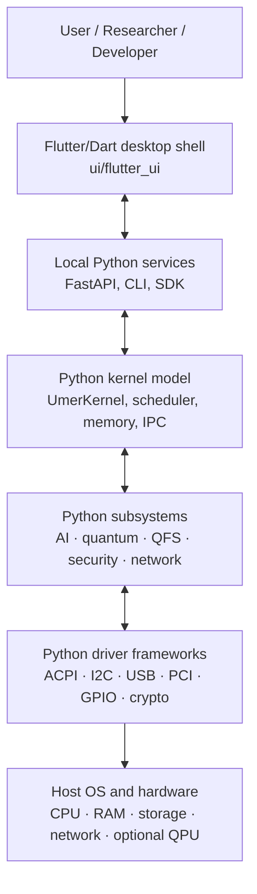
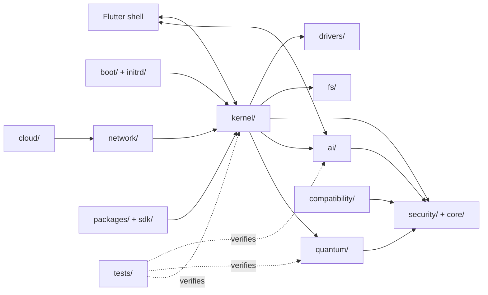
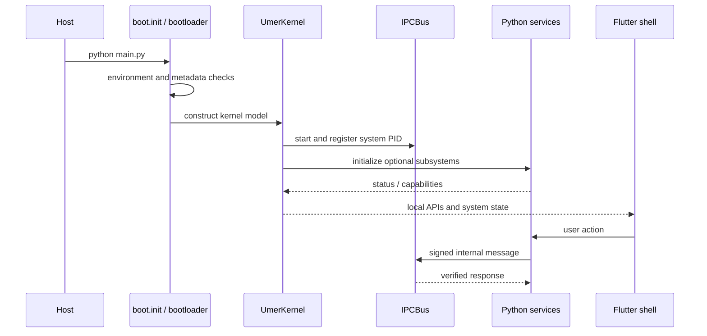
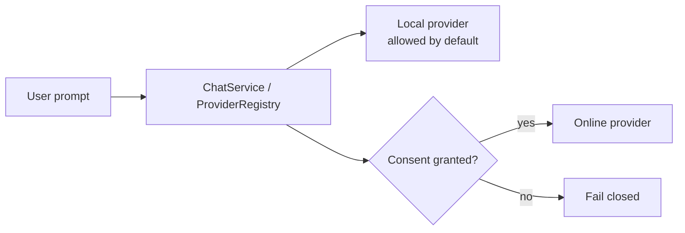

# UmerOS

> **A Python-first operating-system research platform with a hybrid classical/quantum software stack, local-first AI services, a modular kernel model, and a Flutter desktop shell.**

[](https://www.python.org/)
[](https://flutter.dev/)
[](LICENSE)
[](https://github.com/MUmerYasin/UmerOS)
[](https://github.com/MUmerYasin/UmerOS/actions/workflows/ci.yml)

UmerOS is an **experimental and educational systems project**, not a production replacement for Linux, Windows, macOS, or Android. Its purpose is to provide a coherent laboratory for exploring operating-system abstractions, quantum-computing simulation, AI-assisted resource management, security governance, storage, device frameworks, and cross-platform user experience—all in a codebase whose primary implementation language is **Python**, with the canonical frontend implemented in **Flutter/Dart**.

> **Reality boundary:** UmerOS currently simulates or prototypes many OS mechanisms in user space. Quantum hardware execution, production-grade isolation, native boot-time kernel execution, and broad binary compatibility remain research or future work. Read the status labels before relying on a feature.

## Contents

- [For newcomers](#for-newcomers)
- [Research scope and status](#research-scope-and-status)
- [System model](#system-model)
- [Architecture](#architecture)
- [Subsystems](#subsystems)
- [Repository map](#repository-map)
- [Python and Flutter boundary](#python-and-flutter-boundary)
- [Installation](#installation)
- [Run the Python services](#run-the-python-services)
- [Run the Flutter shell](#run-the-flutter-shell)
- [Test and quality gates](#test-and-quality-gates)
- [Representative APIs](#representative-apis)
- [AI governance and privacy](#ai-governance-and-privacy)
- [Security considerations](#security-considerations)
- [Quantum computing model](#quantum-computing-model)
- [Boot and initrd model](#boot-and-initrd-model)
- [Compatibility layer](#compatibility-layer)
- [Documentation and research materials](#documentation-and-research-materials)
- [Roadmap](#roadmap)
- [Contributing](#contributing)
- [Known limitations](#known-limitations)
- [License and attribution](#license-and-attribution)

## For newcomers

If you are new to operating systems or quantum computing, start here:

1. Read [`docs/user_manual.md`](docs/user_manual.md) for the user-facing mental model.
2. Read [`docs/architecture.md`](docs/architecture.md) for the boot flow, IPC flow, memory model, QFS flow, and dependency graph.
3. Run the Python tests before changing code.
4. Explore [`quantum/`](quantum) with [`docs/quantum_tutorial.md`](docs/quantum_tutorial.md).
5. Open the Flutter shell in [`ui/flutter_ui/`](ui/flutter_ui) and begin at `lib/main.dart`.
6. Use the feature labels below: **TODAY** means an implemented prototype, **EXPERIMENTAL** means incomplete or environment-dependent, **FUTURE** means planned, and **BLOCKED** means currently unavailable.

### The short version

| Question | Answer |
|---|---|
| What is it? | A Python systems research prototype with a Flutter user interface |
| Is it a bootable commercial OS? | No; most kernel facilities are user-space simulations/prototypes |
| What does Python implement? | Kernel model, services, quantum simulation, AI, storage, networking, security, drivers, tools |
| What does Flutter implement? | The canonical desktop shell and its interactive apps |
| Does it use a real quantum computer? | Not by default; local simulation and provider abstractions are included |
| Is AI cloud-connected by default? | No; the governance layer is designed to fail closed for online providers |

## Research scope and status

UmerOS deliberately separates implemented mechanisms from architectural goals:

| Tier | Meaning | Examples in this repository |
|---|---|---|
| ✅ **TODAY** | Runs as Python or Flutter code on ordinary development hardware | State-vector simulation, HMAC IPC bus, capability registry, QFS prototype, initrd builder/runtime, Flutter shell |
| 🔬 **EXPERIMENTAL** | Implemented but incomplete, optional, heuristic, or environment-dependent | AI prediction and self-healing decisions, cloud quantum providers, PE loading/auditing, hardware bindings, container adapters |
| 🔮 **FUTURE** | Design target rather than a production capability | Fault-tolerant QPU integration, native boot kernel, broad syscall compatibility, fully autonomous repair |
| ❌ **BLOCKED** | Constrained by external platform or hardware conditions | Unsupported proprietary application formats and unavailable hardware capabilities |

This README documents the code that exists and identifies aspirational material as such. Module-level documentation and the `TODAY`/`EXPERIMENTAL`/`FUTURE` labels are the authoritative way to judge maturity.

## System model



The repository is best understood as a **layered research platform** rather than a conventional monolithic kernel:

1. `main.py` enters through `boot.init.boot`.
2. Python boot and kernel orchestration initialize simulated kernel facilities.
3. The kernel exposes scheduling, memory, signed IPC, capabilities, signals, softirqs, resource groups, and device-facing abstractions.
4. Services provide quantum execution, AI orchestration, storage, networking, compatibility, packaging, installation, and cloud/OTA experiments.
5. `ui/flutter_ui` provides the canonical interactive desktop experience and calls local services where integrations are available.

## Architecture

### High-level dependency graph



### Boot and runtime sequence



### Scheduling model

The scheduler and quantum adapters use ordinary Python execution with quantum-inspired scoring—not quantum acceleration. A simplified conceptual score is:

```text
score(task) = quantum_probability × priority / (cpu_time + ε)
```

`kernel/scheduler.py` and the quantum adapters should be read together with `docs/architecture.md`; the exact implementation and available class names may vary between compatibility shims and the newer kernel modules.

## Subsystems

### Kernel and core services

The `kernel/` package contains the Python microkernel model and supporting primitives. Important facilities include:

| Area | Representative implementation | Responsibility |
|---|---|---|
| Orchestration | `kernel/umer_kernel.py` | Kernel lifecycle, process/task coordination, status and shutdown |
| Scheduling | `kernel/scheduler.py` | Tasks, priorities, readiness, hybrid/quantum-inspired selection |
| Memory | `kernel/memory_manager.py` | Page-aligned simulated allocation, ownership, compaction and statistics |
| IPC | `kernel/ipc_bus.py` | Async queues, directed messages, pub/sub, HMAC-SHA256 verification |
| Permissions | `kernel/capability_manager.py`, `core/capability_gate.py` | Capability registration, grant/revoke/check, fail-closed gates |
| Signals | `kernel/signals.py` | Cooperative signal delivery and task lifecycle actions |
| Deferred work | `kernel/softirq.py`, `kernel/workqueue.py` | Async softirq vectors, tasklets, deferred work |
| Resource controls | `kernel/cgroup.py`, `kernel/resource.py` | Task grouping and CPU/memory policy models |
| Integrity | `kernel/taint.py`, `kernel/audit.py`, `kernel/panic.py` | Forensic state, audit records and failure reporting |
| Hardware boundary | `kernel/hal.py` | Optional `ctypes` binding to the HAL shared library |

The kernel package uses best-effort imports so partial installations can still expose the parts that are available. This is useful for research, but it also means a successful import does not imply that every optional subsystem is operational.

### Quantum computing

`quantum/` is a broad Python quantum software laboratory. It includes:

- State-vector simulation and measurement (`simulator.py`, `statevector.py`).
- Circuit, register, gate and operator abstractions (`circuit.py`, `gates.py`, `operators.py`).
- Circuit libraries for Bell, GHZ, error-correction and educational circuits (`circuit_library.py`).
- Transpilation, topology/coupling maps, routing and optimization (`transpiler.py`).
- V2-style primitives (`primitives.py`) for sampling and expectation values.
- Backend/provider abstractions and cloud sessions (`providers/`, `cloud/`).
- Quantum random generation and BB84 QKD (`qrng.py`, `qkd.py`).
- Pulse-level control models (`pulse_control.py`).
- Error mitigation and noise-related experiments.
- Quantum-inspired scheduler and IPC adapters.

The local simulator stores `2^n` amplitudes, so memory and runtime grow exponentially. It is appropriate for experiments and teaching, not large-scale quantum workloads.

### AI and governance

The `ai/` package is local-first by design:

- `ai/umer_ai.py` provides the canonical resource predictor, local assistant, anomaly heuristics and self-healing engine interfaces.
- `ai/assistant_service.py` provides shared chat configuration, bounded session history and provider routing.
- `ai/providers.py` adapts local and online provider protocols.
- `ai/consent.py` persists a human-readable, default-deny consent ledger.
- `ai/model_manager.py` manages an optional local GGUF catalogue and downloads.
- `ai/server.py` exposes a loopback-bound FastAPI service for the Flutter shell.
- `ai/self_healing.py` records capability-gated mitigation decisions; it intentionally does not execute generated patches.

Online-provider use must remain opt-in. API keys should be supplied through environment variables or protected local configuration and must never be committed.

### Storage and filesystem research

The `fs/` package explores a quantum-inspired/content-addressed filesystem model:

- CAS-style content addressing and deduplication.
- LZMA-backed compression experiments.
- Metadata and keyword indexing.
- Snapshots and restoration.
- File lifecycle and statistics APIs.

`initrd/` complements this work with an in-memory VFS, CPIO reader/writer, archivers, module resolution, hooks, scenarios, an eight-phase boot state machine, pivot-root semantics, and a `/init`/`/linuxrc` runtime model.

### Security

Security-related code is distributed across `security/`, `core/`, `kernel/`, `quantum/`, and selected drivers:

- Capability-based authorization.
- HMAC-signed IPC.
- Audit and taint tracking.
- Sandboxing and container policy models.
- Secure-boot/hash verification experiments.
- Cryptographic primitives and post-quantum-ready interfaces.

Some files are explicitly demonstrations or placeholders. In particular, a class named `QuantumSafeCrypto` must not be interpreted as proof of post-quantum security merely because it uses AES; consult the implementation and its status label before using it in a security-sensitive system.

### Drivers and device frameworks

`drivers/` is a Python model of kernel-style driver subsystems. The tree includes device registration and links, buses, resource management, platform drivers and device trees, as well as frameworks for:

- ACPI and power management.
- PCI and PCI endpoints.
- USB, virtio, RPMsg and NTB communication.
- I2C/SMBus and SPI.
- GPIO, pin control, input, TTY and console.
- Clock, reset, regulator, PWM and thermal management.
- CPU idle and devfreq governors.
- NVMEM, MTD, EDAC, IIO and counters.
- Hardware crypto abstractions and DMA buffers.

These modules model APIs and lifecycle semantics; they do not automatically provide safe access to arbitrary physical hardware.

### Compatibility

`compatibility/` contains two related ideas:

1. A conservative pure-Python PE/NE/MZ parser, registry model, Win32/NT export stubs, import resolver and `WineShim` audit path. It can inspect and report unresolved imports without executing arbitrary x86 code.
2. Older container/syscall-shim adapters for Linux, Windows and Android application concepts.

The compatibility README is the most precise reference for the PE parser's supported headers, registry views, public exports, CLI commands and limitations.

### Networking, cloud, packages and installer

- `network/` contains async network, discovery, DNS/DoH, VPN/tunnel and QoS-oriented experiments.
- `cloud/` contains synchronization, OTA and remote-service abstractions; cloud behavior is optional and environment-dependent.
- `packages/` contains the UmerOS package CLI and registry concepts; `umer-pkg` is registered by `setup.py`.
- `installer/` contains installation, backup, deployment, rollback and boot integration experiments.
- `sdk/` re-exports stable-looking kernel, quantum, AI and UI entry points for application authors.

## Repository map

```text
UmerOS/
├── ai/                 Local-first AI, providers, consent and model management
├── boot/               Python bootloader and initialization experiments
├── cloud/              Sync, OTA and cloud-service abstractions
├── compatibility/      PE/NE parsing, Win32/NT stubs and app adapters
├── core/               Cross-cutting capability and policy gates
├── drivers/            Python device, bus, power, storage and I/O frameworks
├── docs/               Architecture, API, installation, user and quantum guides
├── fs/                 QFS, CAS, compression, indexing and snapshots
├── initrd/             Initramfs builder, runtime, hooks and boot phases
├── installer/          Installation, deployment, backup and rollback tools
├── kernel/             Kernel lifecycle, scheduler, memory, IPC and primitives
├── MainTask/           Design context, prompts and source research material
├── network/            Networking, discovery, VPN and protocol experiments
├── packages/           Package manager and registry client
├── quantum/            Simulator, circuits, compilers, providers, QKD and cloud
├── sdk/                Developer-facing re-exported APIs
├── security/           Sandbox, authentication and security services
├── tests/              Python tests and fixtures
├── ui/                 Python-era prototypes plus canonical Flutter frontend
│   └── flutter_ui/     Flutter/Dart desktop application
├── examples/           Demonstrations and integration examples
├── scripts/            Maintenance and repository checks
├── pyproject.toml      Ruff, Mypy, pytest and coverage configuration
├── setup.py            Package metadata, extras and console entry points
├── requirements.txt    Bounded Python dependency requirements
├── Dockerfile          Python service container image
└── docker-compose.yml  App + Caddy deployment composition
```

Additional root folders (`bin`, `build`, `dev`, `etc`, `home`, `HostFiles`, `legal`, `lib`, `media`, `mnt`, `opt`, `proc`, `root`, `sbin`, `sources`, `srv`, `tmp`, `usr`, and `var`) represent OS layout, build/development assets, fixtures, or deployment placeholders. `node_modules/` is third-party JavaScript material and is not part of the Python runtime. The historical prompt and raw-data files in `MainTask/` are design/research inputs, not executable OS services.

## Python and Flutter boundary

UmerOS has two implementation languages with a deliberate boundary:

| Layer | Language | Location | Role |
|---|---|---|---|
| System model and services | Python 3.12+ | Root packages, `kernel/`, `ai/`, `quantum/`, `drivers/`, etc. | Runtime prototypes, APIs, simulation, orchestration and tests |
| User interface | Dart via Flutter | `ui/flutter_ui/` | Canonical desktop shell, apps, state, theme, services and widgets |

The Flutter application starts in `ui/flutter_ui/lib/main.dart`, restores preferences and app state, registers providers, configures Material 3 themes, and mounts `DesktopShell`. Its source is organized into `src/core`, `src/apps`, `src/widgets`, `src/services`, `screens`, and animation/support modules. The Flutter project declares packages including `provider`, `flex_color_scheme`, `google_fonts`, `flutter_animate`, `http`, `file_picker`, `shared_preferences`, and `webview_flutter_windows`.

The older Python UI modules remain in the repository for compatibility or historical reference. They are not the canonical frontend. New interface work should target Flutter/Dart only.

## Installation

### Python environment

Python 3.12 or newer is the supported project configuration in `pyproject.toml` and `setup.py`.

```bash
git clone https://github.com/MUmerYasin/UmerOS.git
cd UmerOS
python3.12 -m venv .venv
# Linux/macOS
source .venv/bin/activate
# Windows PowerShell: .venv\Scripts\Activate.ps1
python -m pip install --upgrade pip
python -m pip install -e ".[dev]"
```

Useful extras are defined in `setup.py`:

```bash
python -m pip install -e ".[quantum]"
python -m pip install -e ".[ml]"
python -m pip install -e ".[net]"
python -m pip install -e ".[security]"
python -m pip install -e ".[all]"
```

For a broad dependency installation instead:

```bash
python -m pip install -r requirements.txt
```

For reproducible deployments, generate and install a hash-pinned lock file as described in `requirements.txt`.

### Flutter environment

Install the Flutter SDK compatible with the Dart constraint in `ui/flutter_ui/pubspec.yaml`, then:

```bash
cd ui/flutter_ui
flutter pub get
flutter analyze
flutter test
flutter run -d windows   # or linux, macos, chrome, or another configured device
```

The repository's Flutter project is a desktop-oriented application, while platform folders for Android, iOS, Linux, macOS, Web and Windows are present for Flutter tooling.

## Run the Python services

### Boot entry point

```bash
python main.py
```

The entry point calls `boot.init.boot`. Because UmerOS is pre-alpha and contains multiple evolving integration paths, use the focused commands below when the full boot path is not appropriate.

### AI HTTP service

```bash
python -m ai.server
# or
uvicorn ai.server:app --host 127.0.0.1 --port 8421
```

The service is intended to remain loopback-bound. Its documented endpoints include `/health`, AI status/provider/config routes, consent routes, chat, and local-model management. The port can be changed with `UMEROS_AI_PORT`.

### Compatibility CLI

```bash
python -m compatibility selftest
python -m compatibility info
python -m compatibility audit path/to/program.exe
python -m compatibility run path/to/program.exe --dry-run
```

### Initrd CLI

```bash
python -m initrd selftest
python -m initrd scenarios
python -m initrd archivers
python -m initrd build out.img.gz normal
python -m initrd inspect out.img.gz
python -m initrd run out.img.gz
```

### Examples

```bash
python examples/run_demo.py
python -m boot.bootloader
```

Examples and older documentation may reference APIs that have since moved. If an example disagrees with the imported source, treat the source and current tests as authoritative and open an issue describing the drift.

## Test and quality gates

Python tests are configured through `pyproject.toml` and CI:

```bash
python -m pytest tests/ -q --tb=short
python -m pytest tests/ --cov=. --cov-report=term-missing --cov-fail-under=30
ruff check .
ruff format --check .
mypy --ignore-missing-imports --no-error-summary .
bandit -c pyproject.toml -r .
pre-commit run --all-files
```

The GitHub Actions workflow runs Python 3.12 and 3.13 test matrices, coverage, Ruff, Mypy, secret scanning, pre-commit, and README module-drift checking. Several quality jobs are currently warning-oriented (`continue-on-error: true`); a green workflow is therefore not equivalent to a production-readiness certification.

For the Flutter frontend:

```bash
cd ui/flutter_ui
flutter analyze
flutter test
```

## Representative APIs

### Kernel, memory and IPC

```python
import asyncio
from kernel.umer_kernel import UmerKernel
from ai.umer_ai import AIResourceManager

async def run():
    kernel = UmerKernel(total_memory_bytes=512 * 1024 * 1024)
    await kernel.init()
    pid = kernel.spawn_process(
        name="research-service",
        priority=0.8,
        capabilities=["fs.read", "net.send"],
    )
    kernel.inject_ai_manager(AIResourceManager())
    await kernel.main_loop(ticks=10)
    print(kernel.status())
    await kernel.shutdown()

asyncio.run(run())
```

The stable conceptual contracts are also documented in [`docs/api_reference.md`](docs/api_reference.md) and [`docs/developer_guide.md`](docs/developer_guide.md). In particular, `MemoryManager` requires positive page-aligned memory, `CapabilityManager.check` raises on denial, and `IPCBus.receive` verifies message authentication.

### Quantum simulation

```python
from quantum.circuit_library import bell_state_circuit
from quantum.simulator import StatevectorSimulator

circuit = bell_state_circuit("00")
result = StatevectorSimulator().run(circuit, shots=1024)
print(result)
```

For gateway-based circuit execution, see [`docs/quantum_tutorial.md`](docs/quantum_tutorial.md) and the current `quantum/` modules.

### QFS

```python
from fs.qfs import QFS

qfs = QFS(max_store_bytes=512 * 1024 * 1024, lzma_preset=3)
qfs.mount("/")
address = qfs.write_file("/data/report.txt", b"UmerOS research\n")
snapshot = qfs.snapshot()
print(qfs.read_file("/data/report.txt"), address)
qfs.restore_snapshot(snapshot)
```

### AI consent

```python
from ai.consent import AIGovernance

governance = AIGovernance()
# Online-provider access should remain denied until explicitly granted.
# Inspect and manage consent through the governance API or ai.server.
print(governance)
```

## AI governance and privacy

The intended privacy model is:



- Local inference is the preferred path.
- Online providers require explicit consent.
- Consent is stored in a human-readable ledger under the configured UmerOS AI state directory.
- API keys must be kept outside source control.
- Model downloads are user-initiated and should be reviewed like any external binary/model supply chain.
- Telemetry, cloud sync and remote AI should not be assumed active merely because adapters exist.

## Security considerations

UmerOS contains security research code, not a security warranty. Before using any component in a real system:

1. Review the implementation and its dependency chain.
2. Do not treat simulated sandboxing as equivalent to OS-level isolation.
3. Do not expose development FastAPI services to a network without authentication, TLS and a threat model.
4. Keep credentials out of `settings.local.json`, committed configuration, logs and examples.
5. Use authenticated encryption and vetted key management for real data; demonstration CBC/placeholder code is not sufficient.
6. Treat the PE loader as an auditor/parser unless an execution path has been independently reviewed.
7. Run secret scanning and inspect historical commits before publishing derived artifacts.

## Quantum computing model

UmerOS uses quantum computing in three distinct senses:

1. **Classical simulation:** NumPy-based state vectors and circuit operations.
2. **Quantum-inspired control:** Scheduling, IPC demonstrations and resource heuristics borrow quantum terminology or probabilistic scoring while executing classically.
3. **Provider abstraction:** `quantum/providers/` and `quantum/cloud/` define paths toward external simulators or QPUs.

These are not interchangeable. A quantum-inspired scheduler does not provide quantum speedup, and a state-vector simulator does not execute on a physical QPU. The repository's QKD/BB84 implementation is a protocol simulation and educational instrument.

## Boot and initrd model

The `initrd/` package models an eight-phase flow:

1. Load the image.
2. Convert/unpack the archive into the virtual root.
3. Mount the temporary root.
4. Run `/init` or `/linuxrc`.
5. Resolve modules and mount the real root.
6. Perform pivot-root semantics.
7. Execute the real init.
8. Tear down the initrd.

`PhaseMachine.history`, hook points, scenarios (`normal`, `install`, `recovery`, `live`, `rescue`, `per_machine`), CPIO support and archiver registration make this useful for boot-flow research without claiming that it is a Linux kernel initramfs replacement.

## Compatibility layer

The compatibility package's current conservative contract is:

| Capability | Scope |
|---|---|
| MZ/NE/PE parsing | Header and image metadata inspection |
| Import/export handling | Pure-Python IAT audit and host export lookup |
| Registry | In-memory view plus hive/path models |
| Win32/NT APIs | Stubs and lifecycle contracts for common surfaces |
| Launch/shim | Audit-oriented `WineShim`, not arbitrary native instruction execution |
| Android/Linux containers | Older stop-gap adapters; environment-dependent |

Use `python -m compatibility selftest` and the package README before assuming a binary can run.

## Documentation and research materials

| Document | Purpose |
|---|---|
| [`docs/architecture.md`](docs/architecture.md) | System diagrams, boot sequence, IPC, memory, quantum, AI, QFS and test map |
| [`docs/api_reference.md`](docs/api_reference.md) | Quick import guide and public method contracts |
| [`docs/developer_guide.md`](docs/developer_guide.md) | Kernel, quantum, AI, security, QFS, compatibility, tests and driver guidance |
| [`docs/installation_guide.md`](docs/installation_guide.md) | Environment and deployment experiments, including QEMU and rollback notes |
| [`docs/user_manual.md`](docs/user_manual.md) | Newcomer-oriented usage and feature tiers |
| [`docs/quantum_tutorial.md`](docs/quantum_tutorial.md) | Quantum concepts, circuits, scheduling adapters and experiments |
| [`compatibility/README.md`](compatibility/README.md) | PE/registry/API/CLI reference |
| [`initrd/README.md`](initrd/README.md) | Initrd architecture, CLI, phases, scenarios and hooks |
| [`MainTask/codex_project_context.md`](MainTask/codex_project_context.md) | Design context and known integration issues |
| [`MainTask/prompt/`](MainTask/prompt) | Design prompts, engineering blueprints and research reports |
| [`MainTask/Raw Data/`](MainTask/Raw%20Data) | Source documents and raw project material; not runtime code |

## Roadmap

### Foundation — strengthen the executable prototype

- Keep README, docs, tests and import paths synchronized.
- Separate canonical APIs from legacy compatibility shims.
- Make CI branch triggers match the repository's default branch.
- Raise coverage and convert warning-only quality checks into blocking checks.
- Remove credentials and sensitive artifacts from source and history.

### Kernel and platform

- Stabilize `UmerKernel` lifecycle and boot integration.
- Define explicit process/service boundaries and capability policy.
- Replace simulated hardware access with audited platform adapters where appropriate.
- Add reproducible QEMU and initrd integration tests.

### Quantum and AI research

- Benchmark simulator scaling and document reproducible workloads.
- Validate transpiler/provider contracts against reference implementations.
- Improve model provenance, download verification and local model lifecycle.
- Keep AI self-healing capability-gated, auditable and rollback-safe.

### User experience

- Continue all new UI development in Flutter/Dart.
- Connect Flutter apps to versioned, authenticated local Python APIs.
- Add cross-platform packaging and end-to-end shell tests.
- Keep old Python UI prototypes clearly marked as retired or historical.

## Contributing

Contributions are welcome from systems researchers, Python developers, quantum-computing practitioners, security engineers, Flutter developers and technical writers.

1. Open an issue describing the design problem or experiment.
2. Keep changes scoped to one subsystem where possible.
3. Add or update tests for behavior changes.
4. Use Python type hints and module documentation; preserve the repository's status labels.
5. Use Flutter/Dart for frontend changes—do not add a new Python UI path.
6. Run the relevant Python and Flutter quality commands locally.
7. Never commit API keys, private model files, generated build output or user data.
8. Document whether a feature is TODAY, EXPERIMENTAL, FUTURE or BLOCKED.

See [`docs/developer_guide.md`](docs/developer_guide.md) and [`docs/driver_writing_guide.md`](docs/driver_writing_guide.md) for subsystem-specific guidance.

## Known limitations

- UmerOS is pre-alpha and not production-ready.
- The Python kernel is a research model; it is not equivalent to a privileged native kernel.
- Quantum simulation has exponential state-vector cost and is hardware-limited by the host.
- Several directories contain historical, transitional or compatibility code alongside newer implementations.
- Documentation from earlier revisions may mention retired Kivy UI modules or APIs that have moved; the canonical UI is Flutter/Dart.
- Hardware, cloud, online AI, QPU, Android, Windows and deployment features depend on external tools and must be tested in their target environment.
- CI currently contains warning-only jobs, and configured coverage is a floor rather than a quality guarantee.
- Docker and Compose files describe service/deployment paths; they do not turn the repository into a bootable operating-system image.
- The `MainTask` prompts and raw documents describe design intent and research context, not necessarily implemented behavior.

## License and attribution

UmerOS is distributed under the **GNU General Public License v3.0 or later**. See [`LICENSE`](LICENSE).

Created and maintained by [Muhammad Umer Yasin](https://github.com/MUmerYasin). Project discussions, issues and contributions are managed through the [GitHub repository](https://github.com/MUmerYasin/UmerOS).

---

**UmerOS is a research platform: make the boundary between experiment and guarantee explicit, test every claim, and keep the system understandable.**
